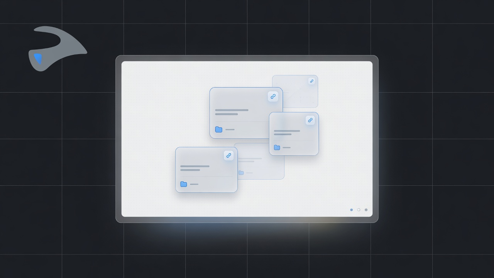
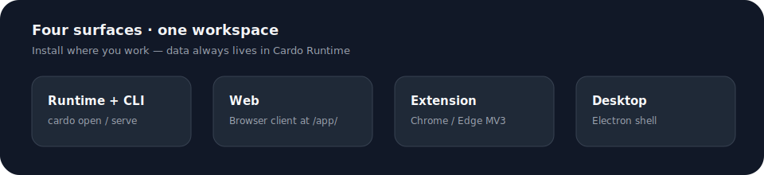
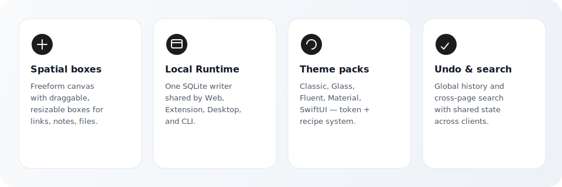
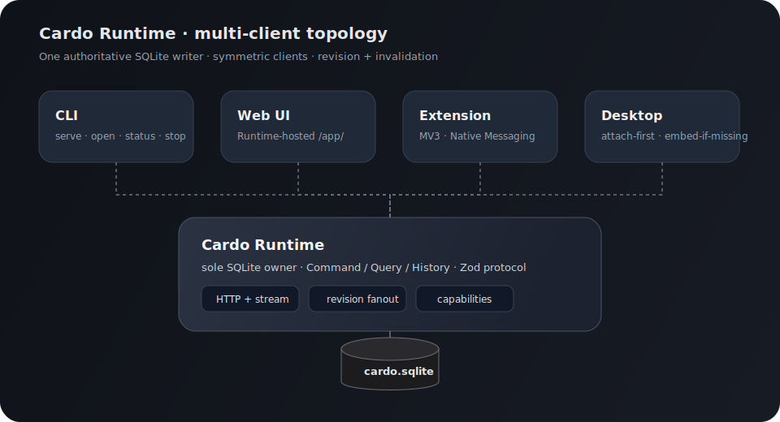

<p align="center">
  <a href="./README.md">English</a> · <a href="./README_zh.md">中文</a>
</p>

<p align="center">
  
</p>

<p align="center">
  Local-first spatial workspace · one Runtime · many clients
</p>

<p align="center">
  
  
  
  
  
</p>

<p align="center">
  
</p>

---

## What is Cardo?

Cardo (Latin cardo: hinge / axis) is a local-first spatial workbench. You organize links, notes, files, folders, bookmarks, and quick-launch items inside freeform boxes on an infinite canvas — across pages, with Favorites and a Recycle Bin.

Unlike a pure browser extension or a single desktop binary, Cardo is a multi-surface product around one authoritative local Runtime:

| Surface           | Role                                                       |
| ----------------- | ---------------------------------------------------------- |
| Cardo Runtime     | Sole SQLite owner and business write path                  |
| CLI (`cardo`)     | Process steward: `serve` / `open` / `status` / `stop`      |
| Web UI            | Graphical client hosted by Runtime at `/app/`              |
| Browser extension | Manifest V3 client; discovers Runtime via Native Messaging |
| Desktop           | Electron shell; attach-first, embed-if-missing             |

All graphical surfaces share the same React UI (`src/web`) and talk to Runtime through a Zod-validated protocol. There is no second long-lived business database in Extension OPFS or Desktop raw SQL IPC.

<p align="center">
  
</p>

---

## Highlights

<p align="center">
  
</p>

### Spatial workspace

- Freeform canvas with pan, lock, and return-to-origin tools
- Boxes you can drag, resize, lock, recolor, and switch between list / grid
- Items: bookmarks, clipboard snippets, local files / folders / shortcuts
- Paste text, URL, or path into a selected box — or create a temporary box when nothing is selected
- Multi-page workspaces, Favorites (read-only box views), and Recycle Bin restore

### Local Runtime authority

- One process holds `cardo.sqlite` and runs Command / Query / History
- Mutations run in a single Drizzle transaction with operation log + undo changeset
- Clients observe the same revision space via HTTP + fetch stream invalidation
- No CRDT, no dual-writer sync, no full Workspace Snapshot as protocol

### Product chrome

- Sidebar shell: pages, Favorites, Recycle Bin, settings foot; main panel title tools
- History undo / redo, canvas tools, bottom search / new box
- Global search across pages, boxes, and items
- Built-in theme pack: Codex (import additional packs via Theme Pack files)
- Interface language: English / 中文
- Feature catalog for chrome slots (Settings → Interface)

### Shell capabilities (non-DB ports)

- Clipboard, browser tabs, website icons, file export
- Open local paths through Runtime capabilities (Native Messaging stays a thin discover / optional relay host — never opens SQLite)

---

## Architecture

<p align="center">
  
</p>

```text
                    ┌─────────┐  ┌─────────┐  ┌──────────┐  ┌─────────┐
                    │   CLI   │  │  Web UI │  │ Extension│  │ Desktop │
                    └────┬────┘  └────┬────┘  └────┬─────┘  └────┬────┘
                         │            │   Native   │             │
                         │            │ Messaging  │ attach/embed│
                         │            │   discover │             │
                         └────────────┴─────┬──────┴─────────────┘
                                            │
                                   ┌────────▼────────┐
                                   │  Cardo Runtime  │
                                   │ HTTP + stream   │
                                   │ Command queue  │
                                   │ Query / History │
                                   └────────┬────────┘
                                            │
                                   ┌────────▼────────┐
                                   │  cardo.sqlite   │
                                   └─────────────────┘
```

Design pillars (start with [`docs/architecture/overview.md`](./docs/architecture/overview.md); SoT: [`docs/architecture/local-runtime-multi-client.md`](./docs/architecture/local-runtime-multi-client.md)):

1. Runtime is the only authority for business writes
2. Zod is the sole runtime boundary for Command, IPC, settings, metadata, and protocol
3. Drizzle schema is the sole relational persistence source
4. UI / Zustand hold ephemeral interaction state only — never a durable full workspace snapshot
5. Clients re-query by InvalidationScope after revision fanout

Default data paths (overridable with `CARDO_DATA_DIR`):

| OS      | Location                                           |
| ------- | -------------------------------------------------- |
| Windows | `%APPDATA%/cardo/cardo.sqlite`                     |
| macOS   | `~/Library/Application Support/cardo/cardo.sqlite` |
| Linux   | `${XDG_CONFIG_HOME:-~/.config}/cardo/cardo.sqlite` |

---

## Repository layout

```text
src/
├── core/          Domain, Zod contracts, Command/Query/History, Drizzle, ports
├── runtime/       HTTP server, lock, discovery, auth, events, capabilities
├── client/        RuntimeClient (HTTP + fetch stream)
├── cli/           cardo serve | open | status | stop
├── web/           Shared product UI (single tree; former web-next + web-v2)
│   ├── app/       CardoApp, start, stores, bootstrap, styles entry
│   ├── shell/     Sidebar shell, settings chrome, FeatureGate
│   ├── features/  Boxes, canvas, settings body, items, search, …
│   ├── kit/       Product UI kit (path imports: kit/button, kit/icon, …)
│   ├── domain/    Pure presentation / geometry helpers
│   ├── styles/    Product CSS + theme recipes
│   ├── themes/    Theme Pack apply / registry
│   ├── i18n/      en + zh product copy
│   └── platform/  RuntimeClient host bridge
├── web-runtime/   Hosted UI entry (Vite base /app/)
├── extension/     MV3 bootstrap, Chrome adapters, Runtime discover
├── desktop/       Electron main / preload / renderer attach-embed
└── native-host/   Thin Native Messaging host (discover + optional relay)

themes/builtin/    Official theme packs (token JSON)
docs/              Architecture, roadmaps, UX acceptance
assets/brand/      Logo, icons, lockups
artifacts/         Build outputs (CLI, extension, desktop, native-host, web-runtime)
```

---

## Requirements

- Node.js 22+ recommended (matches `@types/node` in the toolchain)
- npm
- Windows for the current Desktop packaging path (NSIS + portable); macOS / Linux targets are configured in electron-builder
- Chrome or Edge for the browser extension + Native Messaging host

---

## Quick start

### 1. Install

```bash
npm install
```

### 2. Build CLI + hosted Web UI

```bash
npm run cardo:build
```

### 3. Open Cardo in the browser

```bash
npm run cardo -- open
```

`cardo open` starts a detached Runtime if none is healthy, then opens the Web UI with a one-time code bootstrap (no long-lived token in the URL).

Useful CLI commands:

```bash
npm run cardo -- serve     # foreground Runtime (blocks until Ctrl+C or stop)
npm run cardo -- status    # health / diagnostics
npm run cardo -- stop      # force stop
```

---

## Product surfaces

### Web (primary local UI)

Served by Runtime at `/app/` after `cardo open` or any healthy Runtime session.

### Browser extension

```bash
npm run build
npm run native-host:install
npm run cardo -- open
```

1. Open Chrome / Edge → Extensions → Load unpacked
2. Select `artifacts/extension/unpacked`
3. Click the toolbar action (v1 primary shell is the extension page)
4. Runtime must be running; Native Host must be registered

### Desktop

```bash
npm run desktop:start
```

If Runtime is already up (for example after `cardo serve`), Desktop attaches over the same HTTP + stream path as Web. Otherwise Main embeds Runtime for the same database path.

Package Windows installers (after a full desktop build pipeline):

```bash
npm run desktop:package
```

Artifacts land under `artifacts/desktop-dist/`.

### Native Messaging host

```bash
npm run native-host:build
npm run native-host:install     # Chrome + Edge
npm run native-host:uninstall
```

The host only reads discovery (and may relay); it never opens SQLite.

---

## Development scripts

| Command                       | Description                                                                  |
| ----------------------------- | ---------------------------------------------------------------------------- |
| `npm run dev`                 | Watch-build extension → `artifacts/extension/unpacked`                       |
| `npm run build`               | Stop local instances, build browser extension                                |
| `npm run cardo:build`         | Build CLI + Runtime-hosted Web UI                                            |
| `npm run cardo -- open`       | Ensure Runtime + open Web UI                                                 |
| `npm run cardo -- serve`      | Foreground Cardo Runtime                                                     |
| `npm run desktop:build`       | Build web-runtime + Electron main / preload / renderer                       |
| `npm run desktop:start`       | Build and launch Desktop                                                     |
| `npm run desktop:package`     | Windows NSIS + portable package                                              |
| `npm run native-host:build`   | Build Native Messaging host                                                  |
| `npm run native-host:install` | Register host for Chrome and Edge                                            |
| `npm run build:all`           | Full product compile (extension + CLI + web-runtime + desktop + native-host) |
| `npm run check`               | TypeScript + ESLint + tests                                                  |
| `npm run test:ts`             | TypeScript tests                                                             |
| `npm run format`              | Prettier write for source and README files                                   |
| `npm run clean`               | Remove generated artifacts                                                   |

Feature / fix completion in this repo typically runs `npm run build:all`, then a focused commit and push (see `AGENTS.md`).

---

## Theme packs

Official packs ship under `themes/builtin/`:

| id      | Character                                            |
| ------- | ---------------------------------------------------- |
| `codex` | Default product shell dialect (sidebar + main panel) |

Tokens live in JSON; structural dialect CSS hangs off `[data-cardo-theme]`. User-imported packs register at runtime. Authoring guide: `docs/architecture/theme-pack-authoring.md`. Validate with:

```bash
npx tsx scripts/validate-builtin-themes.ts
```

---

## Tech stack

| Layer            | Choice                                                          |
| ---------------- | --------------------------------------------------------------- |
| Language         | TypeScript                                                      |
| UI               | React 19, Motion, Radix primitives, product `src/web/kit`       |
| Styling          | Tailwind CSS 4, design tokens, theme recipes                    |
| Contracts        | Zod 4 (`z.infer` for types)                                     |
| Persistence      | Drizzle ORM + SQLite                                            |
| Runtime host     | Node HTTP (CLI serve / detached child; Desktop attach or spawn) |
| Desktop shell    | Electron 42 + electron-builder                                  |
| Extension        | Manifest V3                                                     |
| Client transport | RuntimeClient over HTTP + fetch ReadableStream                  |
| UI state         | Zustand (ephemeral only)                                        |

---

## Documentation

| Document                                                                                                 | Topic                                   |
| -------------------------------------------------------------------------------------------------------- | --------------------------------------- |
| [`docs/architecture/README.md`](./docs/architecture/README.md)                                           | Architecture docs index                 |
| [`docs/architecture/overview.md`](./docs/architecture/overview.md)                                       | Contributor executive overview          |
| [`docs/architecture/local-runtime-multi-client.md`](./docs/architecture/local-runtime-multi-client.md)   | Runtime topology, paths, hard decisions |
| [`docs/architecture/robustness-and-operations.md`](./docs/architecture/robustness-and-operations.md)     | Lock, logs, updates, recovery           |
| [`docs/architecture/ui-theme-system.md`](./docs/architecture/ui-theme-system.md)                         | Theme system overview                   |
| [`docs/architecture/theme-pack-authoring.md`](./docs/architecture/theme-pack-authoring.md)               | Writing official / user theme packs     |
| [`docs/architecture/cardo-ui-system-paradigm.md`](./docs/architecture/cardo-ui-system-paradigm.md)       | Product UI layering and kit rules       |
| [`docs/architecture/cardo-ui-kit.md`](./docs/architecture/cardo-ui-kit.md)                               | `src/web/kit` public API                |
| [`docs/architecture/web-v2-codex-shell-design.md`](./docs/architecture/web-v2-codex-shell-design.md)     | Sidebar shell design (cutover complete) |
| [`docs/architecture/zod-drizzle-shadcn-refactor.md`](./docs/architecture/zod-drizzle-shadcn-refactor.md) | Contract and UI boundary refactor notes |
| [`AGENTS.md`](./AGENTS.md)                                                                               | Contributor architecture constraints    |
| [`assets/brand/README.md`](./assets/brand/README.md)                                                     | Brand asset usage                       |

---

## CI and releases

GitHub Actions runs format checks, static analysis, tests, and `build:all` for pushes and pull requests targeting `main`.

Publish a Windows Desktop release by pushing a stable semantic version tag:

```powershell
git tag v0.1.0
git push origin v0.1.0
```

The release workflow packages Desktop only (NSIS installer, portable exe, SHA-256 checksums) and uploads them to the matching GitHub Release. CLI and other clients are expected to ship via npm later.

---

## Contributing

1. Read `AGENTS.md` for non-negotiable architecture rules (single Runtime writer, Zod/Drizzle SoT, no legacy schema dual-read shims).
2. Keep UI free of direct Drizzle imports and business writes.
3. Prefer small, reviewable commits per feature or fix after `npm run build:all` when the change spans product surfaces.
4. Match existing code style; do not reformat unrelated files.

Bug reports and design discussions are welcome via GitHub Issues on this repository.

---

## License

MIT © KhaosBox contributors. See [`LICENSE`](./LICENSE).

---

<p align="center">
  
</p>

<p align="center">
  <sub>Cardo — the hinge of your local workspace</sub>
</p>
