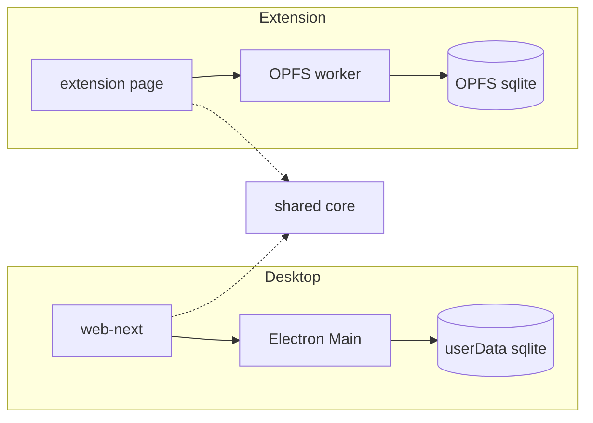
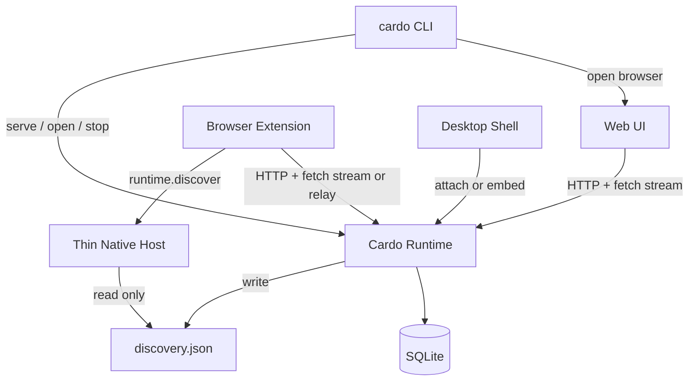
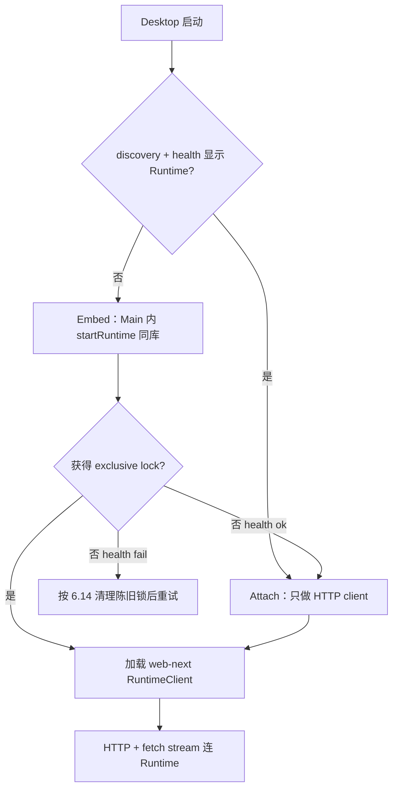

# Cardo Local Runtime 多 Client 架构

| Field | Value |
| --- | --- |
| Status | Active SoT（PR0 起）；Hard Decisions 变更须显式修订本文件 |
| Author | — |
| Date | 2026-07-12 |
| Product name | Cardo（拉丁 cardo：门枢 / 枢纽） |
| CLI / npm | package 优先 `cardo`（冲突则 `@cardo/cli` 等 scope）；bin 恒为 `cardo` |
| Codebase (current) | `D:\Workspace\KhaosBox`（仓库改名另 PR） |
| Inspired by | OpenCode local serve + multi client + event stream（模式参考，非业务复制） |
| Related | `AGENTS.md`, `docs/architecture/zod-drizzle-shadcn-refactor.md`, `docs/architecture/cardo-rename-checklist.md` |

## 1. Overview

Cardo 是本机 workspace 枢纽：把零散入口、链接、文件与片段收进盒子形态的空间工作区，并提供全局快速服务。产品不是「仅插件」或「仅桌面」，而是多个对称 client 连接同一个本机 Runtime。

```text
Cardo Runtime（本机唯一权威进程）
  SQLite + Command/Query/History + 系统能力
        │
        ├─ CLI（npm 安装；启动/发现 Runtime；打开 Web）
        ├─ Web UI（浏览器打开；可由 CLI open）
        ├─ Browser Extension（插件 client；连接 Runtime 获得能力与状态）
        └─ Desktop（壳 client；有 Runtime 则 attach，无则 embed 启动）
```

写路径串行进入 Runtime 的 Command 队列；每次成功的 mutating 事务递增 `runtime_meta.revision`，并向所有订阅者并行扇出 invalidation event；client 按 scope 重新执行 typed query。不引入 CRDT，不做双库同步，不同步 ephemeral UI 状态，不把完整 Workspace Snapshot 当作同步协议。

业务内核复用现有 core：Zod 契约、`executeDatabaseCommand`、typed queries、history、Drizzle schema。平台差异只存在于 Runtime 宿主（CLI Node 进程 vs Desktop Main embed）与 client transport，不复制两套业务引擎。

## 2. 命名

Cardo：拉丁语「门枢、枢纽、轴线」。

- 门枢：全局入口与转折
- 枢纽：零散能力汇聚
- 短、好拼、适合 CLI（`cardo serve` / `cardo open`）

仓库、包名、native host 名从 KhaosBox 迁到 Cardo 的工作单独排期（见 PR0）。本文起统一称 Cardo。OpenCode 仅作本地 HTTP / 多 client / 事件流的模式参考；协议与类型以 Zod 为唯一 SoT，不复制 OpenCode 业务模型。

### 2.1 磁盘路径与数据连续性（命名相关）

AGENTS.md 禁止旧格式双读 shim；但「改路径导致用户数据消失」不是双读，是数据丢失，必须显式策略。

v1 路径政策（Hard Decision）：

1. 权威 SQLite 文件名在迁移完成前保持 `khaosbox.sqlite`（或当前 Desktop 实际文件名），目录由统一 path resolver 解析。
2. Desktop 今日路径：`path.join(app.getPath('userData'), 'khaosbox.sqlite')`。在 productName 仍为 KhaosBox 期间，userData 目录不变，文件名不变。
3. CLI 与 Desktop 共用同一 path resolver 函数（例如 `resolveCardoDataPaths()`），在 rename 完成前解析到与 Desktop 相同的 userData/AppData 目录与同一 sqlite 文件，禁止 CLI 默认写到独立 `%APPDATA%/Cardo/cardo.sqlite` 而 Desktop 仍写旧路径。
4. 产品/仓库 rename 完成后，另开单独「路径搬迁 PR」（不与 rename 同 PR）：一次性 move/copy `khaosbox.sqlite` → Cardo 路径，写 marker「已搬迁」，之后只打开新路径。不是双读；旧路径在 marker 存在后忽略。v1 Runtime 上线阶段始终保持与今日 Desktop 同路径的 `khaosbox.sqlite`。
5. Extension OPFS `khaosbox.sqlite`：v1 不自动合并进 Runtime。PR5 切换 Runtime 模式后 OPFS 写死禁用；用户若需保留扩展数据，用旧版导出 JSON → Runtime 侧 `workspace.import`（PR5/PR7 提供引导文案与导出入口，不静默丢数据无说明）。接受「未导出则扩展 solo 数据不进入 Runtime」为过渡现实，不是静默双写。

## 3. Background & Motivation

### 3.1 当前问题（代码库现状）



现状对照代码：

1. Desktop 与 Extension 共享 core，却各持一份写库与 history。
   - Desktop：`src/desktop/database/desktopDatabase.ts` 在 Electron Main 打开 `userData/khaosbox.sqlite`，IPC 通道 `database:execute` 接近原始 SQL（见 `src/desktop/main.ts`、`src/desktop/preload.ts`）。
   - Extension：`src/extension/database/databaseWorker.ts` 在 OPFS 打开独立 `khaosbox.sqlite`。
2. UI 侧通过 `src/web-next/platform/hostPlatform.ts` 在进程内 `createDatabaseClient(getAppPorts().database)`，再调用 `executeDatabaseCommand` / typed queries。平台边界过薄：业务写虽走 Command Registry，但 DatabasePort 仍是 raw SQL 执行面。三端共享同一 `hostPlatform` 模块。
3. 无法多 client 并行观察同一 workspace：Desktop 与 Extension 数据不互通。
4. 浏览器系统能力靠补丁式 Native Messaging（`src/native-host/main.ts`，仅 `open-local-resource`），不是统一 Runtime。
5. 数据库 opener 只接受 `user_version == 0`（跑 baseline）或精确等于 `DATABASE_SCHEMA_VERSION`（当前 3），否则抛错；无 N→N+1 forward migrator。
6. 野外实际 schema 版本：仅 0（空库）与 3（当前 baseline 直接写 `user_version = 3`）。不存在可运行的 1/2 迁移链（仅有 `drizzle/0000_*.sql`）。

### 3.2 目标产品矩阵

| 表面 | 角色 | 是否持有权威 SQLite |
| --- | --- | --- |
| Runtime | 状态 + 系统能力权威 | 是（唯一） |
| CLI | 入口：安装、serve、open web、status、stop | 否 |
| Web | 图形前端 client | 否 |
| Browser Extension | 图形/入口 client，连接 Runtime | 否（禁止长期权威写库） |
| Desktop | 图形壳 client；可 embed 或 attach Runtime | 否（库只在 Runtime 内；embed 时库在 Main 内的 Runtime 库中） |

说明：

1. 浏览器插件要做，但是 client，不是第二真相源。
2. CLI 要做，本质是入口 / 进程管家，不是 TUI 业务界面。
3. 不做终端 TUI 产品。
4. Extension v1 主入口：工具栏打开独立扩展页（extension page）作为主 client 壳。newtab 不是 v1 主入口；side panel 非 v1 必需。数据面一律 Runtime client。
5. Desktop CAN 宿主 Runtime（embed 同一库），但 MUST NOT 在 CLI 已 serve 时再开第二写者。

### 3.3 可复用资产

| 资产 | 路径 | 备注 |
| --- | --- | --- |
| Command 执行 | `src/core/application/executeDatabaseCommand.ts` | 单 txn：handler + op log + history |
| Command 契约 | `src/core/contracts/workspaceCommands.ts` | Zod discriminated union |
| Queries | `src/core/database/workspaceQueries.ts` | projection / tabs / boxes / items / prefs |
| History | `src/core/application/historyEngine.ts` | undo/redo 在独立 txn；会写 op log |
| Schema | `src/core/database/schema.ts` | Drizzle SoT；`app_state` 含 `activePageId` |
| History tables | `src/core/contracts/history.ts` | 无 `runtime_meta` 行类型（保持如此） |
| UI | `src/web-next/*` | 共享图形壳 |
| 刷新 scope 思路 | `src/web-next/app/stores/workspaceStore.ts` | 今日 client 侧 `getCommandRefreshScope`；Runtime 后改为服务端推导 |
| Preferences store | `src/web-next/app/stores/preferencesStore.ts` | 独立于 workspaceStore 刷新 |
| Ports | `src/core/ports/*` | clipboard / tabs / localResource / fileExport / websiteIcons |
| Native host | `src/native-host/*` | 收窄为 discover + optional relay；永不写 SQLite |

## 4. Goals & Non-Goals

### Goals

1. 单一 Cardo Runtime 持有 SQLite 与全部业务写路径。
2. CLI（npm）安装与启动；`cardo` / `cardo open` 打开 Web。
3. Browser Extension 作为 client 连接 Runtime，获得状态与系统能力。
4. Desktop 作为 client：已有 Runtime 则 attach；没有则由 Desktop embed 启动 Runtime。
5. 任意时刻全局最多一个权威 Runtime 写者（exclusive lock）。
6. 多 client 事件并行同步（revision + scope invalidation + re-query）。
7. Zod 协议唯一契约；复用 Command/Query/History；类型用 `z.infer`。
8. 系统能力在 Runtime 执行（打开本地路径等）。
9. forward migration runner：`version < CURRENT` 时按 N→N+1 顺序迁移。
10. HTTP 暴露的同时 token auth 默认开启。

### Non-Goals

1. 云多端同步 / CRDT / OT。
2. Event Sourcing 取代当前库状态。
3. Extension 与 Runtime 双写长期共存。
4. CLI 做成逐条系统调用的薄 bridge（应是 Runtime 宿主入口）。
5. TUI 产品。
6. 完整 Workspace Snapshot 作为多 client 同步协议。
7. 旧 schema / 旧字段 / 旧持久化格式的双读兼容 shim。
8. 严格 OCC 冲突拒绝（`baseRevision` 在 v1 仅 advisory）。
9. 自动双向合并 Extension OPFS 与 Desktop 文件库（仅可选一次性 import）。

## 5. Hard Decisions

1. 产品名：Cardo；CLI bin：`cardo`；npm package 优先注册 `cardo`，冲突则 `@cardo/cli`（或同类 scope），bin 名不变。
2. 唯一写者：Runtime 进程内 SQLite。
3. Client：Web、Extension、Desktop 对称接入同一协议。
4. CLI：进程管家 + Web 入口，不是第三套 UI。
5. Desktop 与 CLI 的 Runtime 关系：attach-first, embed-if-missing；共享 `src/runtime` 库与同一 db 路径。
6. 同步：revision + invalidation event + typed re-query；不发全量 snapshot 作协议。
7. revision 存 `runtime_meta`，永不进入 history change set；undo/redo 也 +1。
8. 必须有 forward migration runner，实现位于 `src/core/database/migrator.ts`；PR1 起接入 Desktop/Extension opener 与 Runtime。
9. Token 默认开启，与 Runtime HTTP 同阶段上线；`auth.bootstrap` 使用 Bearer processToken（discovery 同一 token）。
10. 无旧 schema/snapshot 兼容双读；仅单向迁移。路径搬迁是 rename 完成后的单独 PR（一次性 move），不是双读；v1 保持 `khaosbox.sqlite` 同路径。
11. InvalidationScope 由 Runtime 根据 DB/changeset 服务端推导，不信任 client projection。
12. import 只走 command `workspace.import`；无独立 import HTTP 写路径。
13. v1 共享 `activePageId` 与全局 undo 栈；产品文案说明多窗口互相影响。
14. Runtime 核心禁止 import electron；可序列化配置用 Zod；host 函数用 TS 接口注入。
15. OpenCode 仅模式参考；Zod 是 SoT。
16. 进程模型：`cardo serve` 前台阻塞；`cardo` / `cardo open` 在无 Runtime 时 spawn 分离（detached）Runtime 子进程，再打开浏览器；`cardo stop` 调 authenticated force shutdown。
17. 端口：动态端口 + discovery 文件（不固定端口）。
18. Desktop attach v1 使用 HTTP/SSE 与 Web 对称；IPC 隧道可选后续，不作为 v1 必需。
19. 事件订阅 transport：`fetch` + ReadableStream（或等价带 Authorization 的 stream），禁止依赖无法设 header 的 `EventSource`；禁止 SSE URL 长效 token。
20. `activity.record` 永不递增 revision，永不写 `history_entries`。
21. Native Messaging host 保持独立瘦进程：只读 discovery（+ optional relay），永不打开 SQLite；Desktop 与 CLI 安装时注册 NM。
22. hostPlatform 双模：按 bootstrap 注入选择 RuntimeClient 或本地 DatabasePort；PR3 只让 Runtime-hosted Web 默认 Runtime，Desktop/Extension 默认本地直至 PR4/PR5。
23. 野外 schema 版本仅 0 与 3；3→4 创建 `runtime_meta`；若见 1/2 则 fail hard。
24. 所有成功 mutation 的 HTTP 响应（`command.ok`、`history.ok`、`ensureInitialized.ok` 当 created）必须带 `revision` + `scopes`，供 initiator 在忽略 self-echo SSE 时 apply。
25. `workspace.ensureInitialized` 首次写入 +revision 并发 SSE（无 history_entries）；幂等 no-op 不涨。
26. Extension v1 主入口：工具栏打开独立扩展页；newtab 非 v1 主入口。
27. Runtime 生命周期：默认「有 client 则保持；零 client 经 grace 后可停」。不是「Desktop 一退就停」。细则见 §6.6.1。

## 6. Proposed Design

### 6.1 拓扑



### 6.2 分层

```text
web-next (Web / Extension page / Desktop renderer)
  -> hostPlatform (dual-mode facade)
       mode=local  -> createDatabaseClient(AppPorts.database)  [pre-PR4/5 defaults]
       mode=runtime -> RuntimeClient
         -> Transport: HTTP + fetch stream (Authorization header)
              Extension: NM discover first; optional NM relay if HTTP blocked
              Desktop v1: same HTTP (not required IPC tunnel)
      -> Cardo Runtime (src/runtime/*)
        -> Zod protocol boundary
        -> Auth middleware (bearer token)
        -> Command queue (serial)
        -> core: executeDatabaseCommand / history / queries
        -> SQLite (exclusive open)
        -> Event hub (fetch-stream SSE fan-out)
        -> Host capabilities (local resource only among OS ports)
        -> Static Web UI (same-origin)
```

目录落位（新增，示意）：

| 路径 | 职责 |
| --- | --- |
| `src/runtime/index.ts` | `startRuntime(config)` / `stopRuntime()` 库入口 |
| `src/runtime/config.ts` | 可序列化字段 Zod + `RuntimeHostHooks` TS 接口 |
| `src/runtime/httpServer.ts` | Node `http` 服务；路由；fetch-stream 事件 |
| `src/runtime/commandQueue.ts` | 串行 command / history / import |
| `src/runtime/revision.ts` | `runtime_meta` 读写与 +1 |
| `src/runtime/invalidation.ts` | 从 changeset 推导 scopes |
| `src/runtime/events.ts` | 订阅者 hub |
| `src/runtime/lock.ts` | exclusive lockfile + pid + health 探测 |
| `src/runtime/discovery.ts` | 写/读 discovery（唯一 secrets 文件） |
| `src/runtime/auth.ts` | token 生成、校验、one-time bootstrap code |
| `src/core/database/migrator.ts` | 平台无关 N→N+1 runner（Desktop opener / Extension Worker / Runtime 共用；无 fs/http/electron） |
| `src/runtime/capabilities.ts` | 打开本地路径等 |
| `src/runtime/paths.ts` | Desktop/CLI 共用 path resolver |
| `src/cli/*` | `cardo` 入口：serve / open / status / stop |
| `src/client/runtimeClient.ts` | 浏览器与 shell 共用的 client |
| `src/core/contracts/runtimeProtocol.ts` | 协议 Zod |
| `src/native-host/*` | 瘦 host：discover + optional relay；无 SQLite |

### 6.3 CLI 与进程模型

| Command | Behavior |
| --- | --- |
| `cardo` | 等价于 `cardo open` |
| `cardo serve` | 前台启动 Runtime；阻塞当前终端；写 discovery + lock；lifetime = `foreground`（用户拥有；不因零 client 自动停）；Ctrl+C 或 `cardo stop` 优雅停机 |
| `cardo open` | 若 discovery+health 显示 Runtime 已运行 → 打开 Web；否则 spawn 分离 Runtime 子进程（lifetime = `auto`），等待 health ready，再打开 Web；本进程不阻塞在 HTTP 服务上 |
| `cardo status` | 读 discovery + `/v1/health` +（有 token 时）`/v1/diagnostics`（含 clientCount、lifetimeMode） |
| `cardo stop` | 任意 startedBy：持 process token 调 `POST /v1/shutdown` 强制停机（覆盖 auto grace）；失败再按 pid 信号。这是 steward 显式停止，不要求「零 client」 |
| `cardo desktop` | 启动 Desktop 壳（若已安装；可选） |

分离 Runtime 子进程（Windows）：

1. `cardo open` / `cardo` 使用 `detached: true`、`stdio: 'ignore'`（或日志文件 redirect）、`unref()`。
2. 子进程入口等价 `cardo serve --daemon-child`（内部 flag；lifetime=`auto`）。
3. 日志默认写 `{dataDir}/runtime.log`。
4. 等待循环：poll `GET /v1/health` 与 discovery 出现，超时失败并打印日志路径。
5. `cardo status` 通过 discovery.pid + health 判断子进程是否存活。

CLI 不实现业务 Command 循环。浏览器获得系统能力的路径是：Extension/Web → Runtime API，不是 Extension → CLI 逐调用。

### 6.4 Browser Extension

角色：Cardo 的浏览器侧 client（快速入口之一）。

1. v1 主入口形态：工具栏 action 打开独立扩展页（`chrome.windows` / 扩展 page URL，如 `pages/app.html` 或等价），该页加载 web-next client。newtab override 不是 v1 主入口（可不实现或保持非默认）。side panel 非 v1 范围。
2. UI 仍用 web-next（或嵌入同一构建）。
3. 通过 RuntimeClient 连接本机 Runtime（PR5 起默认；PR5 前仍为 OPFS solo，见 6.14）。
4. 发现方式（v1）：
   - 唯一 primary：Native Messaging `runtime.discover` → 瘦 NM host 只读 discovery 文件，返回 `{ baseUrl, token, pid, revision, schemaVersion }`。
   - Extension 无法直接读用户磁盘 discovery；禁止依赖扩展读文件。
5. 连接成功后：状态读写与「打开本地资源」等能力都经 Runtime HTTP API（或 NM relay）。
6. PR5 起：OPFS/SQLite 权威写路径 compile-time 或 runtime 硬禁用（见 6.14）。
7. Runtime 不可用时：明确 UI「需要启动 Cardo（CLI 或 Desktop）并确保 Native Host 已安装」；不静默第二库。

#### 6.4.1 Native Messaging 进程模型（v1 唯一选择）

```text
Runtime (CLI serve 或 Desktop embed)
  -> 启动时写 discovery.json（含 token、baseUrl、pid、startedBy）
  -> 不注册为 NM host 本身（避免双注册与生命周期耦合）

Thin Native Host (独立二进制，浏览器 spawn)
  -> 处理：runtime.discover | runtime.relay | 过渡期 open-local-resource 转发
  -> 永不 open SQLite，永不跑 Command Registry
  -> discover：读 discovery 文件；文件缺失/过期 → { ok:false, code:'runtime_unavailable' }

Install matrix:
  - Desktop 安装包：安装并注册 NM host（与今日 native-host:install 同类）
  - CLI / npm 安装：同样注册 NM host（否则仅 CLI 用户无法被扩展发现）
  - Extension：NM 失败时 UI 引导「安装 Cardo Desktop 或 CLI，并启用 native host」
```

Relay 消息信封：复用 `runtimeProtocol` 的请求/响应 Zod（外层加 NM framing），不是第二套 command 语言。

`open-local-resource`：优先 Extension → HTTP `POST /v1/capability/open-local-resource`；仅当 HTTP 不可用时 NM relay 到 Runtime 同一 handler。瘦 host 自身不直接 `shell.openPath` 作为长期权威路径（过渡期可保留直开，PR6 删除以免双路径）。

NM 协议变更归属：PR2 落地 discover 读 discovery + 注册路径；PR5 Extension 接入；PR6 删除直开 SQLite/旧直开能力残留。

#### 6.4.2 Extension transport、CORS、COEP/CSP/CORP

| 场景 | 策略 |
| --- | --- |
| 扩展页 fetch loopback | manifest host permission；Runtime CORS 见下 |
| 事件流 | 必须用 `fetch` + ReadableStream（或 POST `/v1/events` stream）带 `Authorization: Bearer`；不用裸 `EventSource` |
| COEP/COOP 阻断 | fallback NM relay |
| Runtime 托管 Web UI | 同源 `/` + `/v1/*`，无 CORS 问题 |

v1 CORS 政策（仅 bind `127.0.0.1`）：

1. 若 `Origin` 匹配 `chrome-extension://*`、`moz-extension://*`、`safari-web-extension://*`：reflect 该 Origin；`Access-Control-Allow-Headers` 含 `Authorization, Content-Type`；`Access-Control-Allow-Methods` 含业务方法。
2. 若 `Origin` 为 `http://127.0.0.1:<runtimePort>` 或 `http://localhost:<runtimePort>`（同源/同 port Web UI）：reflect。
3. 若无 Origin（非浏览器或同进程探测）：不强制 CORS 头。
4. 其他 Origin：不 reflect；预检失败；diagnostics 记 `cors_rejected`。
5. 永不使用 cookie credentials（`Access-Control-Allow-Credentials` 不为业务所需）；认证只靠 Authorization header。
6. 不为「任意网页」设 `*` + 无 auth；loopback + bearer 下 reflect 扩展 Origin 是有意 tradeoff。
7. 同源托管 UI 避免 Private Network Access 预检问题。

### 6.5 Web 与 token bootstrap

1. Runtime 同源托管静态 UI（`/` + `/app/*` + `/v1/*`）。
2. `cardo open` 不得把长效 token 放进 URL。
3. v1 bootstrap 顺序：
   - Steward 凭证 = discovery 中的 process token（与业务 API 同一 Bearer token）。v1 不引入第三种 secret。
   - CLI（或 Desktop Main）调用 `POST /v1/auth/bootstrap`，header 必须为 `Authorization: Bearer <processToken>`（token 来自 discovery 或本进程 Runtime 内存）；loopback only。成功返回 `oneTimeCode`（TTL ≤ 60s，单次使用）。
   - 打开 `http://127.0.0.1:<port>/app/?code=<oneTimeCode>`。
   - Web 页 `POST /v1/auth/exchange` 用 code 换 session token（可与 process token 相同或为其派生会话；v1 允许直接返回同一 process token），存 memory（或 sessionStorage，不写 localStorage 长期）；`history.replaceState` 去掉 code。
   - 失败则展示「重新 cardo open」。
4. 禁止：长效 token query；SSE URL 带 token；禁止单独的 steward-only 密钥类型。
5. Desktop attach：Main 经 preload 注入 baseUrl+token 到 renderer memory（非 URL）。
6. Extension：NM discover 注入 memory。

### 6.6 Desktop：attach-first, embed-if-missing



规则：

1. 单实例锁：见 6.14。第二进程不得双开写库。
2. 发现：discovery 文件是唯一含 token 的 secrets 文件（lockfile 不含 token，只含 pid/baseUrl/port/startedBy、lifetimeMode）。
3. CLI 已 serve：Desktop 只 attach，不 listen 第二 HTTP 端口，不 open 第二 SQLite 写连接。
4. 仅 Desktop：Main embed 同一 `src/runtime` 与 path resolver 的 db；注入 `serveStaticDir` 指向打包的 Web 静态资源；lifetime 默认 `auto`（见 §6.6.1）。
5. 先 Desktop 后 CLI：CLI 发现 health ok → 打印 endpoint，不抢写者。
6. 关闭语义见 §6.6.1（不再「embed 退出即 stopRuntime」）。
7. v1 renderer 一律 HTTP/SSE（与 Web 对称）；IPC tunnel 非 v1 范围。
8. Runtime 核心不得 `import 'electron'`。

#### 6.6.1 Runtime 生命周期（last-client / grace）

产品原则：所有 client 都关闭后才停止 Runtime 更合理；不是 Desktop 一退就停。

##### 术语

| 术语 | 定义 |
| --- | --- |
| Active client | 已 `hello` 成功且仍持有至少一个存活会话：优先计「打开中的 `/v1/events` 流」；若某壳无长连接，则计「显式 session 直至 `POST /v1/session/bye` 或 idle 超时（默认 60s 无 HTTP）」 |
| clientCount | Runtime 内存中 active client 数；暴露于 diagnostics |
| lifetimeMode | `foreground` \| `auto`，写入 discovery/lock |
| grace period | 默认 15s（实现常量可调）：clientCount 从 >0 变为 0 后启动定时器；期间若有新 client 则取消 |

##### lifetimeMode 谁设置

| 启动方式 | lifetimeMode | 停机条件 |
| --- | --- | --- |
| `cardo serve`（前台） | `foreground` | 仅用户：Ctrl+C、`cardo stop`、进程被杀。零 client 不自动停。 |
| `cardo open` / `cardo` spawn 的 detached 子进程 | `auto` | 零 client 并经过 grace → 自动 `stopRuntime`；或 `cardo stop` / 崩溃。 |
| Desktop embed（Main 内 `startRuntime`） | `auto` | 同 auto：零 client + grace → 停；或 `cardo stop` / 显式 shutdown。 |
| Desktop attach（不宿主 Runtime） | n/a | 退出只注销本 client，永不 stop 他人 Runtime。 |

##### Desktop 行为（PR4 必须遵守）

1. Attach 模式退出（关窗/退出 app）：只断开 HTTP/events；不调用 shutdown；不杀 CLI/detached Runtime。
2. Embed 模式关最后一扇窗口：
   - 先 unregister Desktop client（断开 events / bye）。
   - 若仍有 Web / Extension / 其他 Desktop 窗口 client：Runtime 继续跑。若 Runtime 在 Desktop Main 进程内，Main 不得立刻 `app.quit` 杀死进程；应保持后台存活（托盘或 hidden window / `requestSingleInstanceLock` 进程）直到 auto 停机条件满足或用户强制退出。
   - 若已是最后一个 client：进入 grace；grace 结束且仍为零 → `stopRuntime` 清 lock/discovery，然后允许进程退出。
3. 用户强制退出 Desktop（托盘「退出」且选择结束本机 Runtime，或 `cardo stop`）：可调用 authenticated `/v1/shutdown`，无视 clientCount（与 serve 的 stop 一致）。v1 托盘文案区分「仅关闭窗口」与「退出并停止 Runtime」可选；默认「关闭窗口」= unregister + 可能 grace 停，不是静默丢其他 client 连接。
4. 推荐实现简化（允许）：Desktop embed 也 spawn 同库的 detached Runtime 子进程并 attach，使 UI 进程与 Runtime 进程分离，则关 Desktop 窗天然不杀 Runtime；仍须 last-client grace 停 auto 子进程。库代码相同，仅 host 形态不同。

##### Client 注册 / 注销（PR2 实现要点）

```text
on hello.ok:
  register clientId; clientCount++
on events stream open:
  mark clientId streaming
on events stream close / session bye / idle timeout:
  unregister or mark inactive; if clientCount==0 && lifetimeMode==auto:
    start grace timer
on new hello during grace:
  cancel grace timer
on grace fire:
  if clientCount==0 && lifetimeMode==auto: stopRuntime()
on POST /v1/shutdown (Bearer processToken):
  cancel grace; stopRuntime() immediately  // any lifetimeMode
```

Web tab 关闭、Extension 页关闭、Desktop 窗关闭都必须导致 unregister（events abort 即可，不必强制 bye）。

##### 与旧文案对照

- 废止：「Desktop embed 退出默认 stopRuntime」。
- 保留：`cardo serve` 前台由用户拥有生命周期。
- `cardo stop`：强制停，不依赖 zero-client。

### 6.7 单写者命令路径与 clientId

```mermaid
sequenceDiagram
  participant Web as Web clientId=A
  participant R as Runtime
  participant DB as SQLite
  participant Other as Other clients

  Web->>R: POST /v1/hello
  R-->>Web: hello.ok { clientId: A, revision, schemaVersion }
  Web->>R: POST /v1/command
  R->>R: auth + Zod + queue
  R->>DB: txn command + op log + history + revision++
  R-->>Web: command.ok { revision, scopes, result }
  Note over Web: apply scopes; localRevision = revision
  R-->>Web: SSE mutation sourceClientId=A
  Note over Web: ignore self-echo (sourceClientId === self)
  R-->>Other: SSE mutation sourceClientId=A
  Other->>R: query by scopes
```

关键点：

1. 所有 mutating 路径进入同一串行队列。
2. 业务写、op log、history、revision++ 同一 Drizzle transaction（ensureInitialized 首次写入见 §6.8.1，不走 history_entries）。
3. query / hello / export / subscribe / activity.record / bootstrap 不递增 revision。
4. `hello` 分配 `clientId`（UUID）；后续 command/events 关联该 id。
5. mutation event 的 `sourceClientId` 必填。
6. 发起方 apply 规则：凡 HTTP 响应携带 `revision` + `scopes` 且表示成功 mutation 的路径，均以该响应为权威 apply（`command.ok`、`history.ok`、`ensureInitialized.ok` 当 `created=true`）。忽略 `sourceClientId === self` 的 SSE；若仍处理，必须幂等且仅当 `event.revision > localRevision` 才 apply。
7. `localRevision` 只来自服务端（command.ok / history.ok / ensureInitialized.ok / ready / event.revision），client 永不本地 +1。
8. Client 本地 command 队列仅 UX 串行。
9. `history.undo` / `history.redo` 成功时响应 `history.ok { revision, scopes, applied: true }`（shape 与 `command.ok` 同级字段）；`applied: false`（无事可撤销/重做）时不递增 revision、不发 SSE、scopes 可为空。发起方不得依赖 self-echo SSE 来刷新 undo/redo。

### 6.8 Revision

| 项 | 规格 |
| --- | --- |
| 存储 | `runtime_meta.revision`（单行 `id = 1`），永不进 history change set |
| 递增 | 成功的 mutating txn：command 有 changes、undo（applied）、redo（applied）、import、ensureInitialized（首次创建） |
| 不递增 | query、hello、export、subscribe、activity.record、auth bootstrap/exchange、shutdown、diagnostics、ensureInitialized 幂等 no-op、history 当 applied=false |
| baseRevision | v1 advisory |
| undo/redo | 也 +1，永不把 revision 恢复为旧值；HTTP 响应必须带回新 revision + scopes |
| activity.record | 只 append `operation_log`（source 语义保持非 undoable）；不写 `history_entries`；不 +revision |
| history 表 | 不得增加 `runtime_meta` |

实现挂钩：

- `executeDatabaseCommand`：有 changes 时 txn 末 revision++。
- `undoDatabaseCommand` / `redoDatabaseCommand`：成功应用 changeset 后 revision++；Runtime 包装层返回 `history.ok`。
- 空 changes early return：不写 op log、不 +1。

#### 6.8.1 workspace.ensureInitialized

对应今日 `initializeWorkspaceDatabase`（直接 insert，不经 Command Registry / history_entries）。

| 情况 | 行为 |
| --- | --- |
| 已初始化（`app_state` 存在） | 幂等 no-op：不 +revision、不发 SSE；响应 `ensureInitialized.ok { created: false, revision }`（revision 为当前值） |
| 首次写入 | 进入串行 command 队列；单 txn 插入 pages/boxes/app_state/preferences（与现逻辑一致）；revision++ 一次；不写 `history_entries`（不可 undo 初始种子）；发出 mutation SSE，scopes 至少 `projection` + `preferences` + `history`（history flags 通常仍 false）；响应 `ensureInitialized.ok { created: true, revision, scopes }` |
| 并发两 client 首次 | 串行队列保证只有一方 `created: true`；另一方看到已存在则 no-op |

发起方：`created: true` 时按 scopes apply（与 command.ok 同一路径）；忽略 self-echo SSE。

### 6.9 InvalidationScope 与 client store 映射

Runtime 在事务内根据 DB/changeset 推导。不得依赖发起 client 本地 projection。

```text
InvalidationScope =
  | { type: 'projection' }
  | { type: 'workspaceState' }
  | { type: 'pageTabs' }
  | { type: 'pageTabsAndState' }
  | { type: 'pageBoxes'; pageId: string }
  | { type: 'boxItems'; boxId: string }
  | { type: 'preferences' }
  | { type: 'history' }
```

#### 6.9.1 服务端：history 表 → scope

`historyRowChangeSchema` 表：`app_state` | `pages` | `boxes` | `items` | `box_items` | `collection_box_views` | `preferences`。

| changes 形态 | scopes |
| --- | --- |
| 仅 `preferences` | `preferences` + `history` |
| 仅 `app_state` 且只动 active/default page 字段 | `workspaceState` + `history` |
| 仅 `pages` 元数据（rename/reorder 无删页级联） | `pageTabs` 或 `pageTabsAndState` + `history` |
| 仅 `box_items` 且单一 `boxId` | `boxItems` + `history` |
| 仅 `boxes` 且单一 `pageId`（无跨页） | `pageBoxes` + `history` |
| 含 `collection_box_views` | 通常 `projection`（集合视图与多页耦合） |
| 跨 box / 跨 page / 删 box / moveBetweenBoxes / import / 多表混合 | `projection`（+ `history`；含 preferences 时再加 `preferences`） |
| undo/redo | 对 entry.changes 走同一映射；无法收窄则 `projection` |

过宽策略：宁可 `projection`，不可漏刷。

#### 6.9.2 Client：scope → query → store

| Scope | RuntimeClient 调用 | 更新的 store |
| --- | --- | --- |
| `projection` | `query.workspaceProjection` + `query.historyState`；若需要一并 `query.preferences`（full catch-up 必带） | `workspaceStore` projection + history flags；full catch-up 时 `preferencesStore` |
| `workspaceState` | `query.workspaceState` | `workspaceStore` active/default page 字段 |
| `pageTabs` | `query.pageTabs` | `workspaceStore.pages` |
| `pageTabsAndState` | `query.pageTabs` + `query.workspaceState` | `workspaceStore` pages + state |
| `pageBoxes` | `query.pageBoxes(pageId)` | `workspaceStore` 替换该 page 的 boxes |
| `boxItems` | `query.boxItems(boxId)` | `workspaceStore` 该 box.items |
| `preferences` | `query.preferences` | `preferencesStore`（不是仅 historyOnly） |
| `history` | `query.historyState` | `workspaceStore` historyPast/Future flags |

说明：

1. 远程 client 收到 `preferences` scope 必须刷新 `preferencesStore`；禁止只依赖发起方本地 refresh。
2. PR3 起 Runtime 模式路径用上表；local 模式可暂保留 `getCommandRefreshScope` 直至 PR6。
3. full catch-up = projection + historyState + preferences。

### 6.10 事件重连与 catch-up

Transport：`GET /v1/events` 或 `POST /v1/events` 使用 `fetch` + body/stream，请求头 `Authorization: Bearer <token>`。Content-Type 为 SSE 文本流（`text/event-stream`）即可；实现是 fetch stream 解析，不是 `EventSource` API。

```text
localRevision = 0
selfClientId = hello.ok.clientId

on subscribe ready { revision: R }:
  if R !== localRevision: fullCatchUp(); localRevision = R
  else: localRevision = R

on mutation event E:
  if E.sourceClientId === selfClientId: ignore  // 已由 command.ok / history.ok / ensureInitialized.ok 处理
  if E.revision <= localRevision: ignore
  if E.revision === localRevision + 1: applyScopes(E.scopes); localRevision = E.revision
  else: fullCatchUp(); localRevision = queriedRevision

on disconnect:
  backoff reconnect; on ready if revision !== localRevision → fullCatchUp
```

不在协议中回放历史 mutation；DB 当前状态为 SoT。

### 6.11 协议（Zod）

模块：`src/core/contracts/runtimeProtocol.ts`  
所有 wire 请求/响应/事件用 Zod；类型 `z.infer`。禁止手写重复业务 interface。

#### 6.11.1 请求种类

```text
hello
command { baseRevision?: number, command: WorkspaceCommand }
history.undo | history.redo
  -> history.ok { revision, scopes, applied }   # 成功 mutation 与 command.ok 同级 apply 路径
query.workspaceProjection | workspaceState | pageTabs | pageBoxes | boxItems
query.preferences | historyState | globalSearch | operationLog
workspace.ensureInitialized { locale, colorMode }
  -> ensureInitialized.ok { created, revision, scopes? }
activity.record { action, target?, details? }
workspace.export
workspace.exportOperationLog   # 点查 operation_log；不 +revision
auth.bootstrap / auth.exchange # Bearer processToken -> oneTimeCode -> session token
capability.openLocalResource { path }
shutdown                       # authenticated stop
# import 仅 command workspace.import
```

| 能力 | 今日路径 | Runtime 协议 |
| --- | --- | --- |
| 初始化 | `initializeWorkspace` | `workspace.ensureInitialized`（首次写 +revision + SSE；幂等 no-op 不涨） |
| 业务写 | `dispatchDatabaseCommand` | `command` → `command.ok` |
| undo/redo | history helpers | `history.undo` / `redo` → `history.ok`（含 revision+scopes；self-echo 可忽略） |
| 查询 | hostPlatform query* | typed `query.*` / `query.ok` |
| 活动日志 | `recordActivity` | `activity.record`（不 +revision） |
| 工作区导出 | `exportWorkspaceData` | `workspace.export` → client `fileExport` 下载 |
| 操作日志导出 | `exportOperationLog` | `workspace.exportOperationLog` 或 `query.operationLog` → client 下载 |
| 导入 | `workspace.import` command | 仅 command |
| 打开本地路径 | localResource port / NM | `capability.openLocalResource` |
| 剪贴板/Tabs/图标 | AppPorts | 仍各 shell AppPorts，不进 Runtime DB 协议 |

#### 6.11.2 示意 Zod 骨架

```typescript
// wire protocol only — design sketch
export const helloRequestSchema = z
  .object({
    type: z.literal('hello'),
    client: z.enum(['web', 'extension', 'desktop', 'cli-probe']),
    clientVersion: z.string().min(1),
  })
  .strict();

export const helloOkSchema = z
  .object({
    type: z.literal('hello.ok'),
    clientId: z.string().uuid(),
    revision: z.number().int().nonnegative(),
    schemaVersion: z.number().int().positive(),
    auth: z.object({ tokenRequired: z.literal(true) }).strict(),
    features: z.array(z.string()).default([]),
  })
  .strict();

export const commandOkSchema = z
  .object({
    type: z.literal('command.ok'),
    revision: z.number().int().nonnegative(),
    scopes: z.array(invalidationScopeSchema),
    // reuse existing DatabaseCommandResult fields
    result: z
      .object({
        createdPageId: z.string().optional(),
        createdBoxId: z.string().optional(),
        createdItemId: z.string().optional(),
      })
      .strict()
      .optional(),
  })
  .strict();

// Same initiator-apply path as command.ok when applied === true
export const historyOkSchema = z
  .object({
    type: z.literal('history.ok'),
    revision: z.number().int().nonnegative(),
    scopes: z.array(invalidationScopeSchema),
    applied: z.boolean(),
  })
  .strict();

export const ensureInitializedOkSchema = z
  .object({
    type: z.literal('ensureInitialized.ok'),
    created: z.boolean(),
    revision: z.number().int().nonnegative(),
    scopes: z.array(invalidationScopeSchema).optional(), // required when created === true
  })
  .strict();

export const mutationEventSchema = z
  .object({
    type: z.literal('mutation'),
    revision: z.number().int().positive(),
    scopes: z.array(invalidationScopeSchema).min(1),
    sourceClientId: z.string().uuid(), // required
  })
  .strict();
```

发起方统一 apply 入口（RuntimeClient）：

```text
onMutatingHttpOk(response):
  if response has applied === false or created === false without scopes:
    localRevision = response.revision  // still align
    return
  applyScopes(response.scopes)
  localRevision = response.revision
// used by command.ok, history.ok (applied), ensureInitialized.ok (created)
```

#### 6.11.3 HTTP 路由

| Method | Path | Auth | 说明 |
| --- | --- | --- | --- |
| GET | `/v1/health` | no | `{ ok, pid, startedBy }` 无 token/无工作区 |
| POST | `/v1/auth/bootstrap` | Bearer processToken（discovery 同一 token） | 发 oneTimeCode；无第三 steward secret |
| POST | `/v1/auth/exchange` | oneTimeCode body | code → session/process token |
| POST | `/v1/hello` | Bearer | 返回 hello.ok + clientId |
| POST | `/v1/command` | Bearer | → command.ok |
| POST | `/v1/history/undo` | Bearer | → history.ok { revision, scopes, applied } |
| POST | `/v1/history/redo` | Bearer | → history.ok { revision, scopes, applied } |
| GET | `/v1/query/*` | Bearer | 含 operation-log |
| POST | `/v1/workspace/ensure-initialized` | Bearer | → ensureInitialized.ok |
| POST | `/v1/activity/record` | Bearer | |
| GET | `/v1/workspace/export` | Bearer | |
| GET | `/v1/workspace/export-operation-log` | Bearer | 点查 |
| POST | `/v1/capability/open-local-resource` | Bearer | |
| GET/POST | `/v1/events` | Bearer | fetch stream SSE |
| GET | `/v1/diagnostics` | Bearer | |
| POST | `/v1/shutdown` | Bearer | 优雅停机；校验 startedBy 策略可选 |
| GET | `/` `/app/*` | session UX | 静态 UI |

错误 shape：`{ ok: false, code: string, message: string }`  
例：`unauthorized`、`invalid_payload`、`cors_rejected`、`runtime_unavailable`、`stale_lock`、`schema_mismatch`。

### 6.12 系统能力与非 DB ports

```text
DB 状态写: 一律 Runtime command/query
打开本地路径: Runtime capability（或 NM relay 到同一 handler）
clipboard / tabs.openUrl / websiteIcons / fileExport 下载对话框:
  仍由各 shell AppPorts 实现（Extension chrome API / Desktop electron / Web browser）
  不进入 Runtime SQLite，不进 multi-client 同步
```

### 6.13 Ephemeral UI（不同步）

Camera、选中、拖拽中 frame、rename、菜单、窗口位置 → client Zustand。

v1 共享：`activePageId`、全局 undo/redo。产品文案说明多窗口互相影响。

### 6.14 Exclusive lock、dual-track、OPFS 硬禁用

#### Lock + health

| 机制 | 规格 |
| --- | --- |
| Lockfile | `{dataDir}/runtime.lock`：pid、startedBy、startedAt、baseUrl、port（无 token） |
| Discovery | `{dataDir}/discovery.json`：baseUrl、pid、token、startedBy、startedAt、schemaVersion（唯一 secrets；权限见 §9） |
| 获取锁 | 原子创建；失败则进入冲突解析 |
| 冲突解析 | (1) 读 lock (2) `GET baseUrl/v1/health` (3) health ok → attach，不抢锁 (4) pid 死且 health 失败 → 删 lock+discovery 重试 (5) pid 活但 health 连续失败超过 timeout（如 2s×3）→ 视陈旧锁清理（防 Windows PID 复用误判：优先 health，pid 仅辅助） |
| SQLite | 单写连接；WAL |
| stop | `POST /v1/shutdown` 清资源后删 lock/discovery |

#### Dual-track 与 OPFS

| 阶段 | Desktop | Extension | Web |
| --- | --- | --- | --- |
| PR1–PR2 | 本地 opener + migrator；尚无 RuntimeClient 默认 | 本地 OPFS + migrator | 无 |
| PR3 | 仍默认 local DatabasePort | 仍默认 OPFS solo | Runtime-hosted Web 默认 RuntimeClient；`CARDO_USE_RUNTIME=0` 可关 |
| PR4 | renderer 默认 RuntimeClient；Main attach/embed；业务 raw SQL IPC 移除或缩为非业务 | 仍 OPFS solo，与 Runtime 不是同一 workspace | Runtime |
| PR5 | Runtime | RuntimeClient 默认；OPFS 写路径硬禁用；无 Runtime 则引导，不 open OPFS 写 | Runtime |
| PR6 | 删除死代码；Agents 终态 | 删除 OPFS worker 权威写 | Runtime |

硬规则：

1. 同一构建内：`mode=runtime` 时禁止调用 extension worker `execute` 做业务命令（PR5 exit）。
2. PR5 前：文档与 UI 不声称 Extension OPFS 与 Desktop/Runtime 是同一 workspace。
3. Exclusive lock 只保护文件路径 SQLite，不保护 OPFS——故必须靠模式禁用，不能只靠 lock。

### 6.15 RuntimeHostConfig

拆分：可序列化字段 Zod；host 函数 TS 接口。

```typescript
// serializable — Zod
export const runtimeHostConfigFileSchema = z
  .object({
    dataDir: z.string().min(1),
    dbPath: z.string().min(1),
    host: z.literal('127.0.0.1'),
    port: z.number().int().positive().optional(),
    token: z.string().min(32).optional(),
    startedBy: z.enum(['cli', 'desktop']),
    lifetimeMode: z.enum(['foreground', 'auto']),
    clientGraceMs: z.number().int().positive().default(15_000),
    serveStaticDir: z.string().optional(),
    discoveryPath: z.string().min(1),
    lockPath: z.string().min(1),
    logPath: z.string().optional(),
  })
  .strict();

export type RuntimeHostConfigFile = z.infer<typeof runtimeHostConfigFileSchema>;

// process-local DI — NOT wire Zod
export interface RuntimeHostHooks {
  openLocalResource(path: string): Promise<boolean>;
}

export type RuntimeHostConfig = RuntimeHostConfigFile & {
  hooks: RuntimeHostHooks;
};
```

约束：

1. `src/runtime/**` 不得 import electron。
2. Node `http` / `fs` / `path` / `node:sqlite` 可用。
3. path resolver 保证 CLI 与 Desktop 同 db 文件（见 §2.1）。
4. Desktop embed 必须传入 `serveStaticDir`；attach 模式不 listen 端口。

### 6.16 hostPlatform 双模与 RuntimeClient

```text
bootstrap (per surface):
  setHostPlatformMode('runtime' | 'local')
  // optional override: env CARDO_USE_RUNTIME=0|1

hostPlatform.dispatchDatabaseCommand:
  if mode === 'runtime' -> RuntimeClient.command
  else -> createDatabaseClient(AppPorts.database) + executeDatabaseCommand

defaults by PR:
  PR3: Web(runtime-hosted) = runtime; Desktop renderer = local; Extension = local
  PR4: Desktop renderer = runtime
  PR5: Extension = runtime (+ OPFS write hard-off)
  PR6: local path deleted; mode flag removed
```

选择机制：bootstrap 注入（运行时），不是仅靠 compile-time 死代码切分；便于同一 web-next 树被 extension Vite 与 desktop renderer 共用。

非 DB：`openExternalUrl` / clipboard / websiteIcons 仍 AppPorts。`openLocalResource` 在 runtime 模式走 Runtime capability。

Client 队列：本地 UX 串行；`baseRevision` advisory；`localRevision` 仅服务端赋值。

### 6.17 scopesFromChanges 伪代码（完整表意识）

```typescript
function scopesFromChanges(changes: HistoryChangeSet): InvalidationScope[] {
  const tables = new Set(changes.map((c) => c.table));
  const scopes: InvalidationScope[] = [];

  if (tables.has('collection_box_views')) {
    return [{ type: 'projection' }, { type: 'history' }];
  }
  if (tables.has('preferences') && tables.size === 1) {
    return [{ type: 'preferences' }, { type: 'history' }];
  }
  if (onlyAppStateNavigation(changes)) {
    return [{ type: 'workspaceState' }, { type: 'history' }];
  }
  if (onlyPagesMeta(changes)) {
    return [{ type: 'pageTabs' }, { type: 'history' }];
  }
  if (onlySingleBoxItems(changes)) {
    return [{ type: 'boxItems', boxId: singleBoxId(changes) }, { type: 'history' }];
  }
  if (onlySinglePageBoxes(changes)) {
    return [{ type: 'pageBoxes', pageId: singlePageId(changes) }, { type: 'history' }];
  }
  // multi-table, cross-page, deletes, moves, import, items+boxes mix, etc.
  scopes.push({ type: 'projection' });
  if (tables.has('preferences')) scopes.push({ type: 'preferences' });
  scopes.push({ type: 'history' });
  return scopes;
}
```

## 7. API / Interface Changes

### 7.1 新增

| 接口 | 说明 |
| --- | --- |
| `startRuntime` / `stopRuntime` | 库生命周期 |
| `RuntimeClient` | hello、command、query*、subscribe（fetch stream）、export* |
| `runtimeProtocol` Zod | wire 契约 |
| CLI `cardo` | serve/open/status/stop + detached spawn |
| NM `runtime.discover` / `runtime.relay` | 瘦 host |
| 共享 migrator | `src/core/database/migrator.ts`；openers + Runtime |
| path resolver | CLI/Desktop 同路径 |

### 7.2 修改

| 现有 | 变化 |
| --- | --- |
| `executeDatabaseCommand` / history | revision++；Runtime 暴露 history.ok |
| `schema` / `version` | runtime_meta；CURRENT=4 |
| `desktopDatabase.ts` / `databaseWorker.ts` | 调用 core migrator，非仅 exact match |
| `hostPlatform.ts` | 双模 facade |
| `workspaceStore` / `preferencesStore` | scope→store 表；SSE；undo/redo 用 history.ok |
| `desktop/main.ts` | attach/embed；PR4 起 renderer RuntimeClient |
| `nativeMessaging.ts` / native-host | discover + relay |
| `AGENTS.md` | PR0/1 过渡注记；PR6 终态 |

### 7.3 删除（PR6）

- Extension OPFS 权威写
- Desktop 业务 `database:execute`
- hostPlatform local DB 业务路径
- client 权威 `getCommandRefreshScope`
- NM 直开 local resource 旁路（若仍残留）

## 8. Data Model Changes

### 8.1 runtime_meta

```typescript
export const RUNTIME_META_ID = 1;

export const runtimeMeta = sqliteTable('runtime_meta', {
  id: integer('id').primaryKey(),
  revision: integer('revision').notNull(),
});
```

- 单行 id=1；初始 revision=0
- 不进 history；undo/redo 不回滚

### 8.2 Migration runner 与版本清单

位置：`src/core/database/migrator.ts`（平台无关）。

- 输入：dialect-agnostic 回调，例如 `{ getUserVersion(): number, exec(sql: string): void, runInTransaction(fn): void }` + 内嵌 migration SQL 字符串（`?raw` 或编译期常量）。
- 禁止：`fs` / `http` / `electron` / Node-only API。Extension Worker（sqlite-wasm）、Desktop `node:sqlite`、Runtime open 均只提供回调适配。
- 不放在 `src/runtime/*`，避免 browser worker 依赖 Runtime 宿主包。

```text
Supported versions in the wild: 0, 3  (and after PR1: 4+)
version == 0 -> apply baseline 0000_*.sql; set user_version = CURRENT (or stepwise to CURRENT)
version == 1 or 2 -> fail hard (unsupported; no migration scripts exist)
version == 3 -> apply 0001_runtime_meta.sql (CREATE runtime_meta + seed revision=0); set user_version = 4
version == CURRENT -> ok
version > CURRENT -> fail hard
```

PR1 要求：

1. 共享 `runMigrations(adapter)` 被 `desktopDatabase.ts`、`databaseWorker.ts`、Runtime open 三处调用。
2. `DATABASE_SCHEMA_VERSION = 4`。
3. revision++ 代码路径仅在 `runtime_meta` 存在后执行（同 PR 迁移先于服务）。
4. Exit：现有 v3 Desktop DB 用旧 UI local 路径打开仍成功，且库中有 `runtime_meta`。
5. 禁止为 1/2 编造兼容读。

### 8.3 继续使用

业务表 + operation_log + history_entries。不采用 Event Sourcing。export 文件是 transfer document，不是 live sync。

### 8.4 activePageId 与 undo

全局共享；产品文案说明。

## 9. Security & Privacy Considerations

| 项 | 规格 |
| --- | --- |
| 绑定 | `127.0.0.1` only |
| Token | 默认 on；≥256-bit；业务 API 与 events 均 Bearer |
| Bootstrap | one-time code ≤60s；禁长效 URL token；禁 SSE URL token |
| Discovery | 唯一 secrets 文件；Windows：用户 only ACL；POSIX：`0600`；lockfile 不含 token |
| Extension | NM 注入 memory；不写可被普通网页读的长期存储 |
| CORS | §6.4.2 |
| 诊断 | 需 token；不倾倒完整 workspace |
| 路径能力 | `normalizeLocalResourcePath` |
| shutdown | 需 token；防止随意杀进程需本机 token |
| 威胁模型 | 本机跨用户、恶意网页、恶意扩展；同用户已盗 token 不宣称可防 |

## 10. Observability

`cardo status` / `/v1/diagnostics`：

```text
revision, schemaVersion, dbPath, pid, startedBy, lifetimeMode, baseUrl, authEnabled
clientCount
clients[]: { id, kind, connectedAt, lastSeenAt, streaming }
queueDepth, lastMutationAt, uptimeMs
corsRejectedCount, authFailCount
graceActive: boolean
```

日志：启动/停机/锁冲突/health 陈旧清理/迁移/SSE connect。默认不打印用户内容 payload。

## 11. Alternatives Considered

| 方案 | 优点 | 缺点 | 结论 |
| --- | --- | --- | --- |
| 双库同步 | 离线可写 | 冲突、双写 | 拒绝 |
| CRDT / OT | 多写合并 | 与 Command/History 冲突 | 拒绝 |
| Event Sourcing | 审计 | 违背 Agents | 拒绝 |
| CLI 逐调用 bridge | 快 | 无权威状态 | 拒绝 |
| Desktop 永远独立 Runtime | 简单 | 双写 | 拒绝 attach-first |
| EventSource + query token | 简单 | 泄 token | 拒绝 |
| Runtime 进程自注册 NM | 少一个二进制 | 生命周期/双注册 | 拒绝；瘦 host 读 discovery |
| 严格 OCC v1 | 防丢更新 | UX 误伤 | 推迟 |
| CLI 固定端口 | 好记 | 冲突 | 拒绝；动态 + discovery |

## 12. Risks

| 风险 | 严重度 | 缓解 |
| --- | --- | --- |
| 双进程双写 | 高 | lock + health + attach-first |
| Windows PID 复用 | 中 | health 优先于 pid |
| 裸 HTTP / 泄 token | 高 | token 默认；禁 URL 长效 token；discovery ACL |
| SSE 无 header | 高 | fetch stream primary |
| hostPlatform PR3 打断 Desktop/Ext | 高 | 双模 + 默认表 |
| 路径分叉两库 | 高 | 共享 path resolver；§2.1 |
| OPFS 与文件库分叉 | 高 | PR5 硬禁用 OPFS 写；PR5 前不宣称同 workspace |
| scope 漏刷 | 中 | projection 过宽；store 映射表 |
| 自回显双 apply | 中 | sourceClientId + ignore self |
| 迁移卡死 | 高 | 事务；fail hard；仅 0/3→4 |

## 13. Rollout Plan

1. PR0 文档命名 + Agents 过渡注记 → PR1 protocol/migrator/openers → PR2 Runtime+CLI+NM discover → PR3 Web RuntimeClient 双模 → PR4 Desktop → PR5 Extension+OPFS hard-off → PR6 删双写+Agents 终态 → PR7 抛光。
2. Feature flag：`CARDO_USE_RUNTIME=0|1`（修正拼写；无空格）。默认见 §6.16。PR6 删除 flag 与 local 路径。
3. 回滚：单向 schema 升级后旧二进制 fail hard；发布说明写明。
4. 每 Feature：`npm run build` + `npm run desktop:build`；不跑测试套件。

## 14. Open Questions

当前无阻塞实现的未决项。下列用户决策已关闭并写入 Hard Decisions / 正文：

| 原问题 | 决议 |
| --- | --- |
| Extension 主入口形态 | 独立扩展页（工具栏打开）；newtab 非 v1 主入口（§6.4、HD26） |
| Runtime / Desktop embed 生命周期 | 零 client + grace 才可自动停；非 Desktop 一退就停（§6.6.1、HD27） |
| npm 包名 | 先占 `cardo`；冲突则 `@cardo/cli` 等；bin 仍为 `cardo`（HD1） |
| 路径搬迁与 rename | rename 完成后单独搬迁 PR；v1 保持 khaosbox.sqlite 同路径（§2.1、HD10） |

此前已关闭：serve/open 进程模型；动态端口；Desktop HTTP 对称；activity 不 +revision；SSE fetch stream；NM 瘦 host；history.ok；core migrator；bootstrap Bearer processToken。

## 15. Key Decisions

1. 正式名 Cardo；bin `cardo`；npm 优先 `cardo`，冲突 scope；仓库改名另 PR。
2. 四表面 CLI+Web+Extension+Desktop；无 TUI。
3. Runtime 唯一写库；client 对称 Zod 协议。
4. Desktop attach-first, embed-if-missing；共享 runtime 库与 path resolver。
5. Extension client + 瘦 NM discover；v1 主入口为独立扩展页；无权威第二库。
6. CLI：serve 前台（foreground 生命周期）；open/cardo detached spawn（auto）；stop 强制 shutdown。
7. Runtime 生命周期 last-client + grace（auto）；foreground 不自动停；详见 §6.6.1。
8. 动态端口 + discovery；lock 无 token。
9. Desktop v1 HTTP 对称；IPC tunnel 非 v1。
10. revision 在 runtime_meta；undo/redo +1 且 HTTP 返回 history.ok；activity 不 +1；ensureInitialized 仅首次写 +revision。
11. Migrator 在 `src/core/database/migrator.ts`；仅 0 与 3 野外版本；3→4 = runtime_meta。
12. Token 默认 on；bootstrap Bearer processToken；fetch stream；CORS reflect 扩展 Origin。
13. 服务端 scopes + store 映射；hello clientId；忽略 self SSE；mutating HTTP 统一 apply。
14. hostPlatform 双模直至 PR6；PR5 OPFS 写硬禁用。
15. 磁盘路径：v1 与 Desktop 同文件；rename 后单独搬迁 PR。
16. Host config：Zod 字段 + TS hooks。
17. exportOperationLog 进协议；非 DB ports 留 AppPorts。
18. OpenCode 仅模式参考；Zod SoT。
19. PR0/1 Agents 过渡注记；PR6 终态平台边界。

## 16. PR Plan

每个独立 Feature/Fix 完成后分别 `npm run build` 与 `npm run desktop:build`，单独提交推送。不跑测试套件。

### PR0 — 定名 Cardo 文档与标识规划

- Depends: —
- Files: 本文档；改名清单（含 npm 先占 `cardo`、冲突 fallback、路径搬迁列为 rename 后单独 PR）；`AGENTS.md` 过渡注记
- Description: 固化命名、产品矩阵、路径政策、Extension 独立页入口。
- Exit criteria:
  - 文档合入；矩阵含 Extension 与 CLI。
  - Agents 过渡注记存在。
  - 改名清单可执行；路径搬迁不绑本 PR。

### PR1 — Protocol + runtime_meta + migrator + openers

- Depends: PR0
- Files: `runtimeProtocol.ts`（含 `history.ok`、`ensureInitialized.ok`）；`schema.ts`；`version.ts`；`src/core/database/migrator.ts`；`drizzle` 3→4；`executeDatabaseCommand` / `historyEngine`；`desktopDatabase.ts`；`databaseWorker.ts`；invalidation 纯函数
- Description: Zod 协议（hello.ok、history.ok、ensureInitialized.ok、exportOperationLog、mutation.sourceClientId）；runtime_meta；三处 opener 共用 core migrator（无 Node-only 依赖）；revision++。
- Exit criteria:
  - 打开现有 v3 Desktop DB 成功，user_version=4，存在 runtime_meta。
  - Extension opener 同样迁移；worker 可 import core migrator 而不依赖 `src/runtime`。
  - version 1/2 fail hard；>CURRENT fail hard。
  - undo/redo 后 revision +1；协议层 `history.ok` 含 revision+scopes+applied。
  - ensureInitialized 首次写 +revision 并发 SSE；幂等 no-op 不涨。
  - local UI 路径仍可用（未删 DatabasePort）。
  - `npm run build` 与 `npm run desktop:build` 通过。

### PR2 — Runtime 库 + `cardo serve` + token + lock + NM discover

- Depends: PR1
- Files: `src/runtime/*`（含 client 注册与 last-client grace）；`src/cli/*`；discovery/lock/auth/http/events；`src/native-host/*` discover 读 discovery；NM 注册脚本；package bin
- Description: startRuntime；127.0.0.1；token 默认；动态端口；exclusive lock+health；fetch-stream events；lifetimeMode foreground|auto；shutdown；CLI serve/status/stop；瘦 NM discover；detached spawn 供 open。
- Exit criteria:
  - 第二进程不获写锁；health 显示已有实例。
  - 无 token 拒绝业务 API 与 events。
  - pid 复用场景：health 失败可回收陈旧锁。
  - NM discover 在 Runtime 运行时返回 baseUrl+token；Runtime 停返回 unavailable。
  - NM 进程不打开 SQLite。
  - `cardo serve` 前台可用且零 client 不自动退出；detached auto 在零 client + grace 后退出。
  - `cardo stop` 强制停任意 lifetime。
  - `cardo status` 可用（含 lifetimeMode、clientCount）。
  - `npm run build` 与 `npm run desktop:build` 通过。

### PR3 — RuntimeClient + Web 托管 + `cardo open`（双模）

- Depends: PR2
- Files: `src/client/runtimeClient.ts`；`hostPlatform` 双模；`workspaceStore`/`preferencesStore` scope 映射；静态 UI；CLI open + bootstrap/exchange
- Description: Runtime-hosted Web 默认 RuntimeClient；Desktop/Extension 默认 local 不变；catch-up；self-echo ignore；ensureInitialized；exports。
- Exit criteria:
  - Web 双 tab SSE 同步。
  - 断线重连 full catch-up 正确。
  - `cardo open` 不启动阻塞 serve；detached Runtime + one-time code bootstrap；URL 无长效 token。
  - `CARDO_USE_RUNTIME=0` 时 Web 可回退（若实现）或仅 dev；Desktop/Extension 无 Runtime 时行为与 PR2 前一致。
  - extension build 与 desktop build 在 local 模式仍可运行业务。
  - 未删除 local DatabasePort 路径。
  - import 仅 command。
  - `npm run build` 与 `npm run desktop:build` 通过。

### PR4 — Desktop attach / embed

- Depends: PR3
- Files: `src/desktop/main.ts`；preload token 注入；embed Runtime + `serveStaticDir`；path resolver 对齐；业务 `database:execute` 移除；非 DB IPC；lifecycle 与 §6.6.1 对齐（关窗 unregister、embed 有 client 时保持进程/或 detached Runtime）
- Description: attach-first embed-if-missing；renderer 默认 RuntimeClient；attach 不二端口；不因关窗误杀仍有 client 的 Runtime。
- Exit criteria:
  - CLI 已 serve → Desktop attach，无第二 SQLite 写，无第二 listen；退出 Desktop 不杀该 Runtime。
  - 无 Runtime → embed 可用同一 db 路径；静态 UI 资源正确；lifetime=auto。
  - Desktop embed 关窗后若 Web/Extension 仍连接，Runtime 保持可用。
  - 最后 client 断开 + grace 后 auto Runtime 停止。
  - 先 Desktop 后 CLI 不双写。
  - renderer 仅 RuntimeClient 业务写。
  - `npm run build` 与 `npm run desktop:build` 通过。

### PR5 — Extension client + OPFS 硬禁用

- Depends: PR4（NM discover 来自 PR2）
- Files: extension bootstrap（工具栏 → 独立扩展页）；RuntimeClient；OPFS 写路径禁用；引导 UI；可选 OPFS 导出→import 说明
- Description: 独立扩展页为 v1 主入口；Runtime client；NM discover；fetch stream；无 Runtime 引导；OPFS 业务写不可达。
- Exit criteria:
  - 工具栏打开独立扩展页为默认主壳；非 newtab 依赖。
  - Runtime 模式无代码路径对 worker execute 发业务 SQL。
  - 与 Web/Desktop 同 revision 空间；关扩展页正确 unregister client。
  - Runtime 宕机无静默第二库。
  - 文案说明旧 OPFS 数据需导出导入（若需要）。
  - `npm run build` 与 `npm run desktop:build` 通过。

### PR6 — 清理双写 + Agents 终态

- Depends: PR5
- Files: 删 OPFS 权威写、local hostPlatform DB、死 IPC；`AGENTS.md` 平台边界终态；命名残留
- Description: 唯一写者；文档一致。
- Exit criteria:
  - 无第二权威写入口。
  - Agents 描述 Runtime 唯一持库与四表面角色。
  - 无 legacy 双读 shim。
  - `npm run build` 与 `npm run desktop:build` 通过。

### PR7 — 体验抛光

- Depends: PR6
- Files: i18n（activePage/undo 共享说明）；重连 UX；安装/NM 引导；npm 体验
- Exit criteria:
  - Web+Desktop+Extension 同开手工验收。
  - 横切清单勾选完成。
  - `npm run build` 与 `npm run desktop:build` 通过。

### 横切 Exit Criteria

1. Exclusive lock + health：第二写者 attach。
2. Token 默认 on；无 token 拒绝业务 API。
3. 事件：fetch stream + Authorization；reconnect catch-up。
4. Migrator：v3→4 含 runtime_meta；1/2 fail；opener 三处共用。
5. revision：mutating+undo/redo +1；activity 不 +1；不进 history；history.ok / ensureInitialized.ok 形状完整。
6. Extension：无权威第二库；OPFS 写硬禁用（PR5+）。
7. Desktop/CLI 同路径；attach/embed 正确；last-client grace 生命周期（auto vs foreground）。
8. 协议：hello.ok clientId、history.ok、ensureInitialized、activity、export、exportOperationLog、typed queries、import-only-command；bootstrap = Bearer processToken。
9. hostPlatform 双模在 PR3–PR5 不打断未迁移表面。
10. Agents：PR0/1 过渡注记；PR6 终态。
11. Migrator 仅在 core，三 opener 可共用且 Worker 无 runtime 依赖。
12. Extension v1 主入口为独立扩展页。

## 17. References

- `AGENTS.md`
- `docs/architecture/zod-drizzle-shadcn-refactor.md`
- `src/core/application/executeDatabaseCommand.ts`
- `src/core/application/historyEngine.ts`
- `src/core/application/operationLogService.ts`
- `src/core/contracts/workspaceCommands.ts`
- `src/core/contracts/workspaceQueries.ts`
- `src/core/contracts/history.ts`
- `src/core/contracts/database.ts`
- `src/core/database/schema.ts`
- `src/core/database/version.ts`
- `src/core/database/workspaceQueries.ts`
- `src/core/database/initializeWorkspaceDatabase.ts`
- `src/web-next/platform/hostPlatform.ts`
- `src/web-next/app/stores/workspaceStore.ts`
- `src/web-next/app/stores/preferencesStore.ts`
- `src/desktop/database/desktopDatabase.ts`
- `src/desktop/main.ts`
- `src/extension/database/databaseWorker.ts`
- `src/native-host/main.ts`
- `src/core/protocols/nativeMessaging.ts`
- OpenCode serve：本地 HTTP、多 client、事件流（模式参考，非业务复制）
