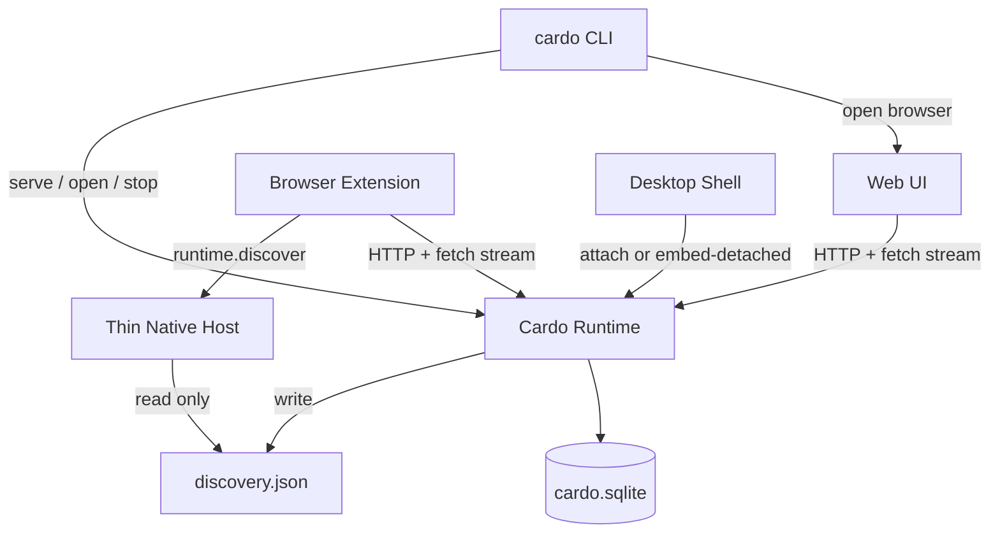
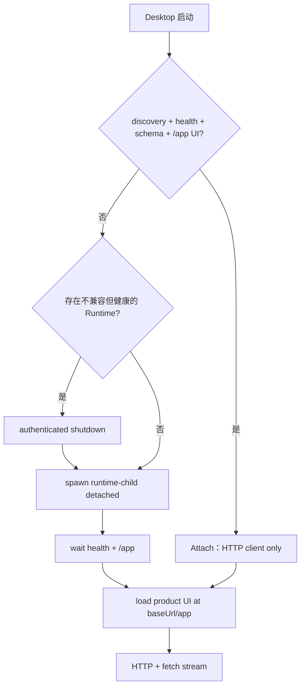
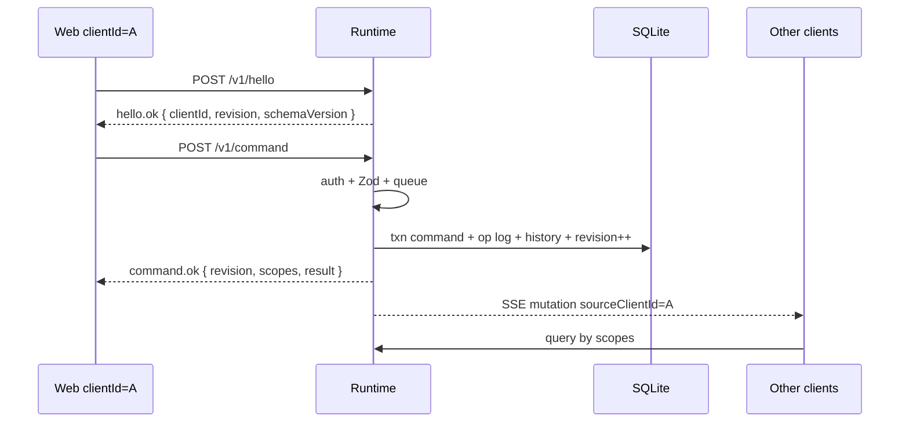

# Cardo Local Runtime 多 Client 架构

| Field | Value |
| --- | --- |
| Status | Active SoT（与代码对齐；Hard Decisions 变更须显式修订本文件） |
| Date | 2026-07-13 |
| Product name | Cardo（拉丁 cardo：门枢 / 枢纽） |
| CLI / npm | package 优先 `cardo`（冲突则 `@cardo/cli` 等 scope）；bin 恒为 `cardo` |
| Schema | `DATABASE_SCHEMA_VERSION = 9`（`src/core/database/version.ts`） |
| Related | `AGENTS.md`, `docs/architecture/overview.md`, `docs/architecture/robustness-and-operations.md` |

本文档是本机 Runtime 多 client 架构的事实来源（SoT）。以仓库代码为准，不描述已退役的双库 / OPFS / raw SQL IPC 现状。

---

## 1. Overview

Cardo 是本机 workspace 枢纽：把入口、链接、文件与片段收进盒子形态的空间工作区。产品不是「仅插件」或「仅桌面」，而是多个对称 client 连接同一个本机 Runtime。



写路径串行进入 Runtime 的 Command 队列；每次成功的 mutating 事务递增 `runtime_meta.revision`，并向订阅者扇出 mutation event（含 `InvalidationScope`）；client 按 scope 重新执行 typed query。

不引入 CRDT，不做双库同步，不同步 ephemeral UI 状态，不把完整 Workspace Snapshot 当作同步协议。

业务内核复用 `src/core`：Zod 契约、`executeDatabaseCommand`、typed queries、history、Drizzle schema。平台差异只存在于 Runtime 宿主（CLI 进程 / Desktop 分离 Runtime 子进程）与 client transport。

---

## 2. Path SoT

Path SoT 由 `src/runtime/paths.ts` 的 `resolveCardoDataPaths()` 定义：

| 项 | 值 |
| --- | --- |
| 目录段 | `cardo`（`CARDO_USER_DATA_DIR_NAME`） |
| 权威 SQLite | `cardo.sqlite` |
| Lock（无 token） | `runtime.lock` |
| Discovery（含 token） | `discovery.json` |
| 日志 | `runtime.log` |
| 用户 Theme Pack 目录 | `themes/` |

默认位置：

| OS | 数据目录 |
| --- | --- |
| win32 | `%APPDATA%/cardo` |
| darwin | `~/Library/Application Support/cardo` |
| linux | `${XDG_CONFIG_HOME:-~/.config}/cardo` |

规则：

1. CLI 与 Desktop 共用同一 resolver；可用 `CARDO_DATA_DIR` 覆盖数据目录。
2. Desktop 在取 `userData` 前 `app.setName('cardo')`，与 resolver 对齐。
3. 仅 `cardo` / `cardo.sqlite`；不做 previous-install 跨目录 relocate。
4. Extension 不持权威库；业务数据只经 Runtime。

---

## 3. Surface matrix

| 表面 | 角色 | 是否持有权威 SQLite |
| --- | --- | --- |
| Runtime | 状态 + 系统能力权威 | 是（唯一） |
| CLI | 入口：serve、open web、status、stop | 否 |
| Web | 图形前端 client（Runtime 同源 `/app/`） | 否 |
| Browser Extension | 图形/入口 client | 否 |
| Desktop | 图形壳 client；attach 或 spawn 分离 Runtime 子进程 | 否（库只在 Runtime 进程内） |
| Native Messaging host | 瘦进程：`runtime.discover`（+ 可选本地路径打开） | 否；永不 open SQLite |

说明：

1. 浏览器插件是 client，不是第二真相源。
2. CLI 是入口 / 进程管家，不是 TUI 业务界面。
3. Extension v1 主入口：工具栏打开独立扩展页；newtab 不是 v1 主入口。
4. Desktop CAN 宿主 Runtime（仅通过 detached child），MUST NOT 在 CLI 已 serve 时再开第二写者。
5. Desktop Main 进程内不 `startRuntime`；embed-if-missing = spawn `runtime-child` 后 attach。

---

## 4. Hard Decisions

1. 产品名 Cardo；CLI bin `cardo`；npm package 优先 `cardo`，冲突则 scoped 名，bin 不变。
2. 唯一写者：Runtime 进程内 SQLite（`cardo.sqlite`）。
3. Client：Web、Extension、Desktop 对称接入同一 Zod 协议；CLI 不实现业务 Command 循环。
4. Desktop：attach-first, embed-if-missing；embed = detached Runtime child（`lifetimeMode=auto`），Main 永不 in-process 持库。
5. 同步：revision + invalidation event + typed re-query；不发全量 snapshot 作协议。
6. revision 存 `runtime_meta`，永不进入 history change set；undo/redo 也 +1（不回滚 revision）。
7. forward-only migration：`src/core/database/migrator.ts`，N→N+1；`DATABASE_SCHEMA_VERSION = 9`；无旧 schema 双读；无 soft column repair。
8. Token 默认开启；`auth.bootstrap` 使用 Bearer processToken（与 discovery 同一 token）。
9. InvalidationScope 由 Runtime 根据 changeset 服务端推导，不信任 client projection。
10. import 只走 command `workspace.import`；无独立 import HTTP 写路径。
11. v1 共享 `activePageId` 与全局 undo 栈；产品文案说明多窗口互相影响。
12. Runtime 核心禁止 `import 'electron'`；可序列化配置用 Zod；host 函数用 hooks 注入。
13. 进程模型：`cardo serve` 前台阻塞（`foreground`）；`cardo` / `cardo open` spawn 分离 Runtime 子进程（`auto`）；`cardo stop` 经 authenticated shutdown 强制停机。
14. 动态端口 + discovery 文件（不固定端口）。
15. Desktop attach 使用 HTTP/SSE 与 Web 对称；IPC 隧道非 v1 必需；禁止业务 raw SQL IPC（无 `database:execute`）。
16. 事件订阅：`fetch` + ReadableStream + `Authorization`；禁止依赖无法设 header 的 `EventSource`；禁止 SSE URL 长效 token。
17. `activity.record` 永不递增 revision，永不写 `history_entries`。
18. Native Messaging host 保持独立瘦进程：discover 只读 discovery；永不打开 SQLite。
19. hostPlatform 仅 RuntimeClient；无 OPFS / local SQLite / `CARDO_USE_RUNTIME` 双模回退。
20. 所有成功 mutation 的 HTTP 响应（`command.ok`、`history.ok`、`ensureInitialized.ok` 当 created）必须带 `revision` + `scopes`。
21. `workspace.ensureInitialized` 首次写入 +revision 并发 SSE；幂等 no-op 不涨。
22. Runtime 生命周期：有 client 则保持；`auto` 模式零 client 经 grace（默认 15s）后可停；`foreground` 不因零 client 自动停。
23. Client session：stream 是通道；注册的 `clientId` 会话在 stream 关闭后仍保留，直至 `session.bye` 或 idle 超时（默认 60s 无 HTTP touch）。

---

## 5. Module map（与代码路径对齐）

| 路径 | 职责 |
| --- | --- |
| `src/runtime/index.ts` | `startRuntime` / `stopRuntime` / `waitUntilRuntimeStopped` |
| `src/runtime/config.ts` | 可序列化字段 Zod + `RuntimeHostHooks` |
| `src/runtime/httpServer.ts` | Node `http`；路由；fetch-stream events |
| `src/runtime/commandQueue.ts` | 串行 command / history / ensureInitialized |
| `src/runtime/clients.ts` | client 注册、streaming 标记、idle sweep、grace |
| `src/runtime/events.ts` | SSE 订阅者 hub |
| `src/runtime/lock.ts` | exclusive lockfile + health 探测 |
| `src/runtime/discovery.ts` | 写/读 discovery（唯一 secrets 文件） |
| `src/runtime/auth.ts` | process token、one-time bootstrap code |
| `src/runtime/database.ts` | 打开 SQLite + 跑 migrator |
| `src/runtime/paths.ts` | Path SoT |
| `src/runtime/capabilities.ts` | openLocalResource 等 hook 封装 |
| `src/core/database/revision.ts` | `getRevision` / `bumpRevision`（`runtime_meta`） |
| `src/core/database/migrator.ts` | 平台无关 N→N+1 runner |
| `src/core/database/version.ts` | `DATABASE_SCHEMA_VERSION` / `BASELINE_SCHEMA_VERSION` |
| `src/core/application/invalidationScopes.ts` | `deriveInvalidationScopes(changes)` |
| `src/core/application/executeDatabaseCommand.ts` | 单 txn：handler + op log + history + revision |
| `src/core/contracts/runtimeProtocol.ts` | wire 协议 Zod |
| `src/core/contracts/workspaceCommands.ts` | Command Zod union |
| `src/client/runtimeClient.ts` | 浏览器与 shell 共用 HTTP client |
| `src/cli/main.ts` | `cardo` serve / open / status / stop |
| `src/desktop/ensureDesktopRuntime.ts` | attach-first；不兼容则 retire；spawn detached child |
| `src/desktop/runtimeChild.ts` | Desktop Runtime 子进程入口（`startedBy=desktop`, `auto`） |
| `src/native-host/*` | 瘦 host：discover；不写 SQLite |
| `src/web/*` | 共享图形 UI |
| `src/web/platform/hostPlatform.ts` | RuntimeClient-only facade |

历史路径说明：旧文档中的 `src/runtime/revision.ts` / `invalidation.ts` 不存在；revision 与 scopes 在 `src/core` 内。

---

## 6. CLI 与进程模型

| Command | Behavior |
| --- | --- |
| `cardo` | 等价于 `cardo open` |
| `cardo serve` | 前台启动 Runtime；阻塞；`lifetimeMode=foreground`；Ctrl+C 或 `cardo stop` 停机 |
| `cardo open` | discovery+health 已运行 → 打开 Web；否则 spawn 分离 Runtime（`auto`），等待 health，再 one-time code 打开浏览器 |
| `cardo status` | 读 discovery + `/v1/health` +（有 token 时）`/v1/diagnostics` |
| `cardo stop` | Bearer process token → `POST /v1/shutdown`；失败再按 pid 信号 |

分离 Runtime 子进程（Windows 等）：

1. `detached: true`、`stdio` 忽略或重定向日志、`unref()`。
2. 子进程入口等价 `cardo serve --daemon-child`（`lifetimeMode=auto`）。
3. 日志默认 `{dataDir}/runtime.log`。
4. 等待循环 poll discovery + `GET /v1/health`。

浏览器获得系统能力的路径是：Extension/Web → Runtime API，不是 Extension → CLI 逐调用。

---

## 7. Desktop：attach-first, embed-detached



实现：`src/desktop/ensureDesktopRuntime.ts`。

规则：

1. Attach 条件：healthy、`discovery.schemaVersion === DATABASE_SCHEMA_VERSION`（`assertRuntimeCompatible`）、Runtime 提供 `/app` 静态 UI。
2. 不满足且仍有健康 Runtime（schema 不匹配 / 无 UI）→ `POST /v1/shutdown` 后 spawn 新 child。
3. Embed = spawn `runtime-child.js`（`ELECTRON_RUN_AS_NODE` 或 Node），`startedBy=desktop`，`lifetimeMode=auto`，`serveStaticDir` 指向 web-runtime 产物。
4. Main 进程不 `startRuntime`，不 open 第二 SQLite 写连接。
5. Attach 退出：只断开 HTTP/events；不 shutdown 他人 Runtime。
6. Embed-detached 退出：UI 进程与 Runtime 进程分离；关 Desktop 窗不杀 Runtime；auto Runtime 由 last-client + grace 自行停。
7. Preload 注入 baseUrl+token 到 renderer memory（非 URL）。
8. Renderer 加载 `${baseUrl}/app/` 同源 UI。

---

## 8. Browser Extension 与 Native Messaging

1. v1 主入口：工具栏 action 打开独立扩展页，加载 `src/web` 产品 UI client。
2. 发现：唯一 primary 是 NM `runtime.discover` → 瘦 host 只读 `discovery.json`，返回 baseUrl、token、pid、schemaVersion 等。
3. Extension 无法直接读用户磁盘；禁止依赖扩展读文件。
4. 业务 I/O 仅 RuntimeClient（HTTP + fetch stream）。
5. 无 OPFS / Worker 权威写库；Runtime 不可用时引导安装 Desktop/CLI 与 Native Host，不静默第二库。

```text
Runtime (CLI 或 Desktop runtime-child)
  -> 写 discovery.json（含 token）

Thin Native Host (浏览器 spawn)
  -> runtime.discover：读 discovery + health probe
  -> 永不 open SQLite，永不跑 Command Registry
```

Install：Desktop 安装包与 CLI/`npm run native-host:install` 均可注册 NM host。

NM 当前实现不包含完整 `runtime.relay` 协议；扩展主路径是 HTTP。本地路径打开优先 `POST /v1/capability/open-local-resource`；host 侧可保留无 Runtime DB 的直开辅助，但不构成第二写库。

### 8.1 CORS（bind 127.0.0.1）

1. Origin 匹配扩展协议或 Runtime 本机 origin → reflect。
2. 无 Origin：不强制 CORS 头。
3. 其他 Origin：不 reflect。
4. 认证只靠 Authorization header；不用 cookie credentials。
5. 事件流必须用 `fetch` + stream，不用裸 `EventSource`。

### 8.2 Web token bootstrap

1. Runtime 同源托管 `/` + `/app/*` + `/v1/*`。
2. `cardo open` 不得把长效 token 放进 URL。
3. Steward 调 `POST /v1/auth/bootstrap`（Bearer processToken）→ `oneTimeCode`（短 TTL、单次）。
4. 打开 `/app/?code=…` → `POST /v1/auth/exchange` → session/process token 存 memory；去掉 code。
5. Desktop：Main 注入 baseUrl+token；Extension：NM 注入 memory。

---

## 9. Client session：stream vs idle

术语与 `src/runtime/clients.ts` / 协议对齐。

| 术语 | 定义 |
| --- | --- |
| Registered client | `POST /v1/hello` 成功后分配的 `clientId` |
| Streaming | 该 client 持有打开中的 `/v1/events` 流 |
| Active session | 仍在 registry 中的 client |
| Idle | 非 streaming 且超过 `clientIdleMs`（默认 60s）无 HTTP touch |
| grace | `lifetimeMode=auto` 且 clientCount 变为 0 后启动（默认 15s） |

### 9.1 注册 / 注销（SoT）

```text
on hello.ok:
  register clientId; cancel grace if any
on events stream open:
  setStreaming(clientId, true)
on events stream close:
  setStreaming(clientId, false)  // 会话保留；不因此 unregister
on any authenticated request with X-Cardo-Client-Id:
  touch(clientId)  // 刷新 lastSeenAt
on POST /v1/session/bye:
  unregister(clientId)
on idle sweep (non-streaming, lastSeenAt 过期):
  unregister(clientId)
on clientCount==0 && lifetimeMode==auto:
  start grace timer
on grace fire:
  if still zero clients: stopRuntime()
on POST /v1/shutdown (Bearer processToken):
  cancel grace; stopRuntime() immediately
```

原则：stream 是通道；`clientId` 会话直到 bye 或 idle 才结束。这样短断线重连可复用同一 clientId，避免「stream 一断 session 死、重连 400」。

`lifetimeMode`：

| 启动方式 | lifetimeMode | 自动停机 |
| --- | --- | --- |
| `cardo serve`（前台） | `foreground` | 否；仅用户/stop/杀进程 |
| `cardo open` detached | `auto` | 零 client + grace |
| Desktop runtime-child | `auto` | 同上 |
| Desktop attach | n/a | 退出只注销本 client |

---

## 10. 单写者命令路径



关键点：

1. 所有 mutating 路径进入同一串行队列。
2. 业务写、op log、history、revision++ 同一 Drizzle transaction。
3. query / hello / export / subscribe / activity.record / bootstrap / exchange 不递增 revision。
4. 发起方以 HTTP 响应的 `revision` + `scopes` 为权威 apply；忽略 `sourceClientId === self` 的 SSE。
5. `localRevision` 只来自服务端；client 永不本地 +1。
6. `baseRevision` 在 v1 仅 advisory。
7. `history.undo` / `history.redo` → `history.ok { revision, scopes, applied }`；`applied=false` 不涨 revision、不发 SSE。

### 10.1 Revision

| 项 | 规格 |
| --- | --- |
| 存储 | `runtime_meta.revision`（单行 `id = 1`） |
| 递增 | 成功 mutating：有 changes 的 command、applied 的 undo/redo、import、ensureInitialized 首次创建 |
| 不递增 | query、hello、export、subscribe、activity.record、auth、shutdown、ensureInitialized no-op、history applied=false |
| undo/redo | +1；永不把 revision 恢复为旧值 |

实现：`src/core/database/revision.ts`。

### 10.2 workspace.ensureInitialized

| 情况 | 行为 |
| --- | --- |
| 已初始化 | 幂等 no-op；`created=false`；不 +revision、不发 SSE |
| 首次写入 | 串行队列；单 txn 种子数据；+revision；不写 history_entries；scopes 至少 projection + preferences + history |

### 10.3 InvalidationScope

协议（`runtimeProtocol.ts`）：

```text
projection | workspaceState | pageTabs | pageTabsAndState
pageBoxes{pageId} | boxItems{boxId} | preferences | history
```

服务端推导：`src/core/application/invalidationScopes.ts` 的 `deriveInvalidationScopes`。过宽策略：宁可 `projection`，不可漏刷。当前实现可不发出 `pageTabsAndState`（多表混合走 `projection`）；协议保留该 scope 供需要时使用。

Client 映射（概要）：

| Scope | 刷新 |
| --- | --- |
| `projection` | workspaceProjection + historyState（full catch-up 含 preferences） |
| `workspaceState` | workspaceState |
| `pageTabs` / `pageTabsAndState` | pageTabs（+ state） |
| `pageBoxes` | pageBoxes(pageId) |
| `boxItems` | boxItems(boxId) |
| `preferences` | preferencesStore |
| `history` | history flags |

### 10.4 事件重连与 catch-up

Transport：`GET` 或 `POST` `/v1/events`，`Authorization: Bearer`，SSE 文本流由 fetch 解析。

```text
on ready { revision: R }:
  if R !== localRevision: fullCatchUp
on mutation E:
  if sourceClientId === self: ignore（已由 HTTP ok 处理）
  if E.revision <= localRevision: ignore
  if consecutive: applyScopes; else fullCatchUp
on disconnect:
  backoff reconnect；ready 时 revision 不一致则 fullCatchUp
```

不在协议中回放历史 mutation；DB 当前状态为 SoT。

---

## 11. Protocol summary

模块：`src/core/contracts/runtimeProtocol.ts`。wire 请求/响应/事件用 Zod；类型 `z.infer`。

### 11.1 请求种类

| 种类 | 说明 |
| --- | --- |
| `hello` | 分配 clientId；返回 revision、schemaVersion |
| `command` | WorkspaceCommand；→ `command.ok` |
| `history.undo` / `history.redo` | → `history.ok` |
| `query.*` | projection / state / tabs / boxes / items / preferences / history / search / operationLog / localThemePacks |
| `workspace.ensureInitialized` | 种子或 no-op |
| `activity.record` | 仅 operation_log |
| `workspace.export` / `exportOperationLog` | 导出 transfer document / 日志 |
| `auth.bootstrap` / `auth.exchange` | processToken → oneTimeCode → token |
| `capability.openLocalResource` | 打开本地路径 |
| `session.bye` | 注销 client |
| `shutdown` | 强制停机 |

import 仅经 command `workspace.import`。

### 11.2 HTTP 路由

| Method | Path | Auth | 说明 |
| --- | --- | --- | --- |
| GET | `/v1/health` | no | pid、port、startedBy、lifetimeMode |
| POST | `/v1/auth/bootstrap` | Bearer processToken | oneTimeCode |
| POST | `/v1/auth/exchange` | oneTimeCode body | token |
| POST | `/v1/hello` | Bearer | hello.ok |
| POST | `/v1/session/bye` | Bearer | 注销 |
| POST | `/v1/command` | Bearer | command.ok |
| POST | `/v1/history/undo` \| `/redo` | Bearer | history.ok |
| GET/POST | `/v1/query…` | Bearer | typed queries |
| POST | `/v1/workspace/ensure-initialized` | Bearer | ensureInitialized.ok |
| POST | `/v1/activity/record` | Bearer | 不 +revision |
| GET | `/v1/workspace/export` | Bearer | |
| GET | `/v1/workspace/export-operation-log` | Bearer | |
| POST | `/v1/capability/open-local-resource` | Bearer | |
| GET/POST | `/v1/events` | Bearer | fetch stream SSE |
| GET | `/v1/diagnostics` | Bearer | 含 clientCount、graceActive 等 |
| POST | `/v1/shutdown` | Bearer | 优雅停机 |
| GET | `/` `/app/*` | UX | 静态 UI |

错误 shape：`{ ok: false, code: string, message: string }`。

认证业务路由通过 `Authorization: Bearer`；events 与 command 使用 `X-Cardo-Client-Id` 关联已 hello 的会话。

### 11.3 系统能力与非 DB ports

```text
DB 状态写: 一律 Runtime command/query
打开本地路径: Runtime capability（hooks）
clipboard / tabs.openUrl / websiteIcons / fileExport:
  各 shell AppPorts（chrome / electron / browser）
  不进入 Runtime SQLite，不进 multi-client 同步
```

### 11.4 Ephemeral UI（不同步）

Camera、选中、拖拽中 frame、rename、菜单、窗口位置 → client Zustand。

v1 共享：`activePageId`、全局 undo/redo。

---

## 12. Exclusive lock

| 机制 | 规格 |
| --- | --- |
| Lockfile | `{dataDir}/runtime.lock`：pid、startedBy、lifetimeMode、status=`starting`\|`ready`、baseUrl/port（ready 时）；无 token |
| Discovery | `{dataDir}/discovery.json`：baseUrl、token、schemaVersion、revision 等；唯一 secrets |
| 获取锁 | 原子创建；冲突则 health 探测 |
| 启动顺序 | status=starting 占坑 → open DB → listen → ready + write discovery |
| 陈旧锁 | health 优先；pid 仅辅助（防 Windows PID 复用误判） |
| SQLite | 单写连接；WAL |
| stop | 清 SSE/HTTP/DB 后删 lock + discovery |

---

## 13. Schema 与 migration

| 常量 | 值 |
| --- | --- |
| `BASELINE_SCHEMA_VERSION` | 3 |
| `DATABASE_SCHEMA_VERSION` | 9 |

野外前进路径：

```text
0 → apply baseline → 3
3 → 4 runtime_meta
4 → 5 system page ids
5 → 6 theme preferences
6 → 7 theme customization
7 → 8 feature flags
8 → 9 layout snippet
1 / 2 → fail hard（无迁移脚本）
version > 9 → fail hard
```

规则：

1. 仅 forward N→N+1；每步事务内执行 SQL 并 `setUserVersion`。
2. 无 soft column repair；无旧字段双读兼容 shim。
3. Migrator 平台无关（无 electron / fs / http）；Runtime 通过 adapter 调用。
4. Client 从不直接跑 migrator；仅 Runtime open DB 时迁移。

`runtime_meta`：单行 `id=1`，初始 revision=0；不进 history。

---

## 14. RuntimeHostConfig

可序列化字段（Zod）：dataDir、dbPath、host=`127.0.0.1`、port、token、startedBy、lifetimeMode、clientGraceMs、serveStaticDir、discoveryPath、lockPath、logPath。

进程内 hooks（非 wire Zod）：

```text
openLocalResource(path): Promise<boolean>
```

约束：`src/runtime/**` 不得 import electron；Node `http` / `fs` / `path` / `node:sqlite` 可用。

---

## 15. Security（摘要）

| 项 | 规格 |
| --- | --- |
| 绑定 | `127.0.0.1` only |
| Token | 默认 on；业务 API 与 events 均 Bearer |
| Bootstrap | one-time code 短 TTL；禁长效 URL token |
| Discovery | 唯一 secrets；POSIX 0600；lock 不含 token |
| 威胁模型 | 同 OS 用户内已盗 token 不宣称可防；防恶意网页 / 跨用户 / 无 token 扫端口 |

运维细节见 `docs/architecture/robustness-and-operations.md`。

---

## 16. Observability

`cardo status` / `GET /v1/diagnostics`：

```text
revision, schemaVersion, dbPath, pid, startedBy, lifetimeMode, baseUrl
clientCount, clients[] { id, kind, connectedAt, lastSeenAt, streaming }
queueDepth, lastMutationAt, uptimeMs
corsRejectedCount, authFailCount, graceActive
```

日志：`{dataDir}/runtime.log`。默认不打印用户内容 payload。

---

## 17. Non-Goals

1. 云多端同步 / CRDT / OT。
2. Event Sourcing 取代当前库状态。
3. Extension 与 Runtime 双写长期共存；OPFS 权威写库。
4. Desktop 业务 raw SQL IPC（`database:execute`）。
5. CLI 做成逐条系统调用的薄 bridge。
6. TUI 产品。
7. 完整 Workspace Snapshot 作为多 client 同步协议。
8. 旧 schema / 旧字段 / 旧持久化格式的双读兼容 shim 与 soft column repair。
9. 严格 OCC 冲突拒绝（`baseRevision` 仅 advisory）。
10. 自动双向合并历史 OPFS 与文件库。

---

## 18. Alternatives（已拒绝）

| 方案 | 结论 |
| --- | --- |
| 双库同步 / CRDT / OT | 拒绝 |
| Event Sourcing | 拒绝（违背 Agents） |
| CLI 逐调用 bridge | 拒绝 |
| Desktop 永远独立第二写库 | 拒绝；attach-first |
| EventSource + query token | 拒绝 |
| Runtime 进程自注册 NM | 拒绝；瘦 host 读 discovery |
| 固定端口 | 拒绝；动态 + discovery |
| Main 进程 in-process embed Runtime | 拒绝；仅 detached child |

---

## Appendix A — 历史：双库时代（非当前）

实现里程碑（PR0–PR6）曾短暂存在 Desktop 文件库与 Extension OPFS 并行写库、`CARDO_USE_RUNTIME` 双模、以及 Desktop Main 内 in-process Runtime 方案。当前代码已删除这些路径：

- 无 Extension OPFS 权威写
- 无 hostPlatform local DatabasePort 业务路径
- 无 `database:execute` 类业务 IPC
- Desktop embed 仅为 detached `runtime-child`

勿将本附录描述为现状。当前拓扑见 §1。
