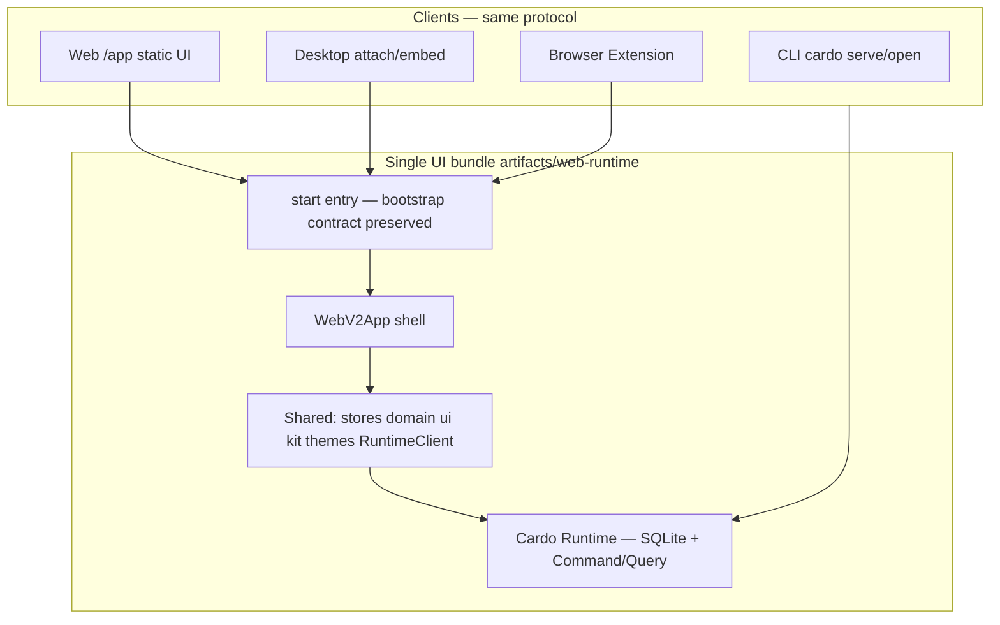
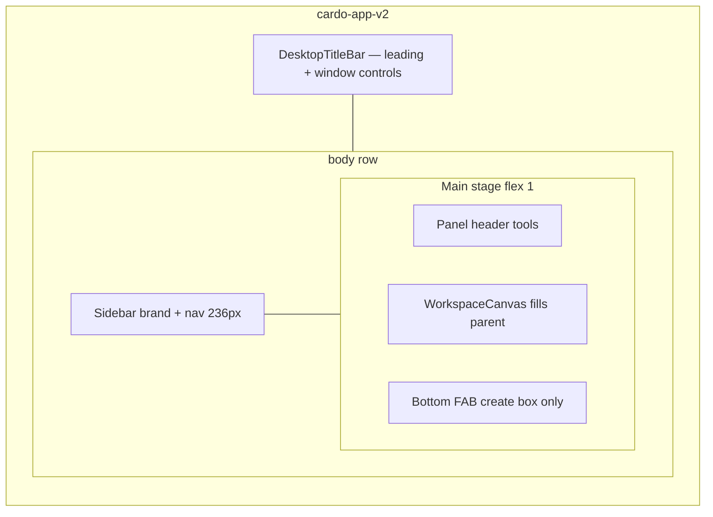
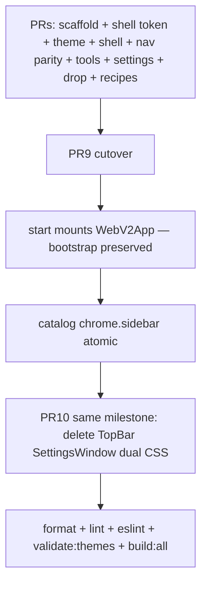
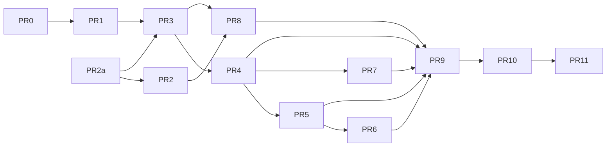

# Cardo Frontend shell + Official Theme `codex`

| Field         | Value                                                                                                                                  |
| ------------- | -------------------------------------------------------------------------------------------------------------------------------------- |
| Status        | COMPLETE (cutover done; dual-folder retired)                                                                                           |
| Date          | 2026-07-14                                                                                                                             |
| Author        | Cardo engineering (AI-assisted)                                                                                                        |
| Repo          | Cardo monorepo                                                                                                                         |
| Prototype SoT | `docs/prototypes/cardo-v2-shell-codex-layout.html`                                                                                     |
| Constraints   | `AGENTS.md`, Theme Pack SoT, Runtime multi-client                                                                                      |
| Related       | `docs/architecture/ui-theme-system.md`, `docs/architecture/theme-pack-authoring.md`, `docs/architecture/local-runtime-multi-client.md` |
| In-repo path  | `docs/architecture/web-v2-codex-shell-design.md` (filename kept for history)                                                           |
| Code paths    | Shell: `src/web/shell/*` · App: `src/web/app/*` · Kit: `src/web/kit/*` · Features: `src/web/features/*`                               |

---

## Cutover status (2026-07-14)

| Item | State |
| --- | --- |
| Production mount | `src/web/app/start.tsx` → `src/web/app/App.tsx` (sidebar shell) |
| Product UI tree | Single `src/web/` (historical `src/web-next` + `src/web-v2` merged and retired) |
| Settings chrome | Full-shell `SettingsShell` only; floating `SettingsWindow` deleted |
| Feature catalog | `chrome.sidebar` (retired `chrome.topBar`) |
| Dual-folder invariants (§8.1) | Retired — no second UI package root |
| Artifact | Still single `artifacts/web-runtime` under base `/app/` |

Below is the design history and PR plan that delivered this shell. Path names in older sections that say `web-v2` or `web-next` map to today’s `src/web/shell`, `src/web/app`, and shared `src/web/*` packages. Prefer live tree layout in `docs/architecture/cardo-ui-system-paradigm.md`.

---

## Overview

Historical baseline before this migration: full-viewport canvas with fixed overlay chrome (floating TopBar page tabs, corner History / CanvasTools, bottom dock, draggable floating Settings).

Target (now production) Codex-inspired product chrome:

- Desktop titlebar and left sidebar share one shell color family (no layered title bar fill that fights the sidebar).
- Product wordmark "Cardo" lives in the left sidebar (`SidebarBrand`); Desktop titlebar is chrome-only (leading controls + window min/max/close) with File menu in `ShellTitleLeading`.
- Sidebar IA: 新建分组 · 收藏 · flat 分组 list · 回收站 · foot 设置 (settings foot is not gated by `chrome.sidebar`).
- Main stage is a rounded white panel: group title + undo/redo/locate/lock · canvas · bottom create-box FAB only (search is sidebar / Ctrl+K).
- Settings is a full-shell swap (same titlebar + nav width), not a long-lived floating window.
- Official Theme Pack id `codex` expresses the Codex-like visual dialect.
- Implementation lives under `src/web` (`shell/`, `app/`, `features/`, `kit/`). Runtime, contracts, stores, domain, and UI kit are shared. Production ships a single `artifacts/web-runtime` under base `/app/`.

This was a product shell migration, not a second app or second static root. Temporary dual folders (`web-next` + `web-v2`) were allowed only under the dual-folder merge invariants in §8.1; cutover and dual-track delete completed, and the dual roots are retired.

---

## Background & Motivation

### Current shell (facts)

Composition root: `src/web/app/WebNextApp.tsx`

```text
cardo-app (100vw × 100vh)
├── DesktopTitleBar          (fixed top, glass-ish surface)
├── BoxPageDropController    (hover TopBar → page drop)
├── TopBar                   (FeatureGate chrome.topBar)
├── HistoryToolbar           (shell.corner overlay)
├── RuntimeConnectionBanner
├── WorkspaceCanvas          (100vw × 100vh via CSS)
├── CanvasToolsToolbar       (locate / lock overlay)
├── BottomToolbar            (settings + search + create)
├── SettingsWindow           (independentMenuStore floating)
└── ContextMenuHost
```

Key couplings that block a pure CSS restyle:

| Seam            | Path                                                           | Problem for sidebar shell                                                               |
| --------------- | -------------------------------------------------------------- | --------------------------------------------------------------------------------------- |
| Canvas geometry | `src/web/styles/canvas.css`                               | `.cardo-canvas { width/height: 100vw/100vh }` forces the observed node to viewport size |
| App shell       | `src/web/styles/shell.css`                                | Full-viewport overlay model; titlebar fixed glass                                       |
| Page drop       | `BoxPageDropController.tsx`, `interactionElementRegistry.ts`   | Drop zone = TopBar rect + tab elements; collection/recycle special cases                |
| UI state names  | `uiStore.boxDragOverTopBar`                                    | Semantics tied to top bar (shared; rename only at cutover)                              |
| Feature catalog | `src/core/contracts/featureCatalog.ts`                         | `workspace.*` `dependsOn: ['chrome.topBar']`, slots `topBar.tab` / `topBar`             |
| Settings chrome | `SettingsWindow.tsx` + `independentMenuStore`                  | Floating window + drag/resize; prototype uses full shell                                |
| Entries         | `web-runtime/main.tsx`, `extension/bootstrap/extensionApp.tsx` | Only `startWebNextApp()`                                                                |
| TopBar parity   | `TopBar.tsx`, `SortablePageTab`, `TabDeleteConfirmView`        | rename, delete+confirm, strip system pages, multiPage gates, DnD reorder                |

### Why v2 folder

Agents forbids long dual-track UI. A new shell that rewires composition, drop targets, and settings chrome is too large to land as scattered edits inside TopBar without a multi-week half-migrated tree. Strategy:

1. Scaffold `src/web` and build the new shell against shared stores/domain/ui without renaming shared APIs mid dual-folder.
2. Keep production on `web-next` until shell + recipes + drop + settings + page parity are ready (user-unreachable tree on main).
3. Flip mount at start entry (single artifact path) in PR9; delete obsolete chrome in PR10 same milestone.
4. Shared store/registry/CSS-class renames land only in cutover/delete PRs (see §5.1).

### Prototype product IA (SoT)

From `docs/prototypes/cardo-v2-shell-codex-layout.html`:

```text
Titlebar (desktop): sidebar toggle | back/forward | File | window controls
  (no product logo/wordmark in titlebar)
Sidebar (~236px × density):
  Brand wordmark "Cardo"
  New group · Search
  Favorites
  Groups (flat list, reorder DnD)
  Recycle Bin
  foot: Settings
Main panel (white, radius token):
  header: group title | undo/redo | canvas tools menu
  canvas: freeform only
  bottom: circular create FAB only
Search: overlay over canvas (Ctrl/Cmd+K)
Settings: full shell swap
  General | Appearance | Data | About
```

Excluded from product (prototype comments):

- Folders / page groups
- Task spinners, download FAB, branch chip, session dock
- Select/pan tool chrome
- Codex agent/chat, plugins, models, config
- Full theme editor / keyboard shortcuts page as first-class settings sections

Capabilities must map only to real Cardo features already in Runtime / feature catalog / workspace model — including TopBar page rename/delete/confirm, not only list+create.

---

## Goals & Non-Goals

### Goals

1. Ship a sidebar + main-panel product shell matching the prototype IA and DesktopTitleBar brand rules, with TopBar page-management parity required before cutover (rename, delete+confirm, system strip, feature gates).
2. Register official theme `codex` end-to-end (SoT checklist + light/dark + recipes + look presets + `validate:themes`).
3. Make canvas fill its parent panel region via CSS/layout (not `100vw`/`100vh`); keep existing ResizeObserver on the canvas node.
4. Move box→page drop targets to sidebar page rows; preserve collection/recycle special cases; decouple TopBar naming only at cutover.
5. Relocate history + canvas tools into the main panel header; bottom bar = search + new box only (settings in sidebar foot, not gated with primary nav).
6. Adopt full-shell settings as the sole settings chrome after cutover (no floating dual-track), with an explicit Settings extraction contract (§3.4).
7. Reuse Runtime client path, contracts, stores, domain, and UI kit; rewrite chrome composition and shell CSS only.
8. Single production entry and single `artifacts/web-runtime` (`base: '/app/'`).
9. Update Feature Catalog so primary nav is sidebar-shaped without old-field compatibility shims — atomically at cutover (PR9).
10. Extend ESLint Drizzle/schema ban to `src/web/**`.
11. Incremental, independently mergeable PR plan with Agents.md gate commands and dual-folder merge invariants.

### Non-Goals

1. Second npm package, monorepo workspace, or second static root (`/app-v2`).
2. New Runtime protocol, Command set, or workspace schema migration for this shell (Theme Pack color token may gain `shell` — see KD-17).
3. Reintroducing multi Layout Profile switcher (floating/zen). Sole product layout remains always-visible chrome; topology simply becomes sidebar.
4. Codex product features (agent, models, plugins, session dock).
5. Long-term dual mount of TopBar shell + sidebar shell; dual tree on main is user-unreachable only.
6. Old schema / old preference key dual-read for retired `chrome.topBar` (unknown keys already dropped by `normalizeFeatureFlagOverrides`).
7. Redesigning box/item content models or drag physics ownership rules.
8. Bumping product version / shipping a Release tag as part of this work.
9. Shared API renames mid dual-folder that break production `web-next`.

---

## Proposed Design

### 1. High-level architecture



Runtime multi-client boundary is unchanged (`docs/architecture/local-runtime-multi-client.md`). Only the React chrome composition changes.

### 2. Folder and ownership model

```text
src/
  core/contracts/*          SHARE — Feature Catalog, Theme Pack SoT, prefs
  runtime/*                 SHARE — untouched for shell work
  web/                 PRODUCTION until PR9; dual folder until PR10
    app/stores/*            SHARE — no renames until cutover
    domain/*                SHARE
    ui/*                    SHARE
    themes/*                SHARE engine (+ shell color token when KD-17 lands)
    i18n/*                  SHARE
    components/canvas|boxes|items  SHARE content with minor adapters
    components/top-bar/*    DELETE in PR10
    components/settings/SettingsWindow.tsx  DELETE in PR10
    components/settings/SettingsPanel.tsx   SPLIT toward SettingsContent (shared)
  web/                   NEW chrome root — not mounted in production until PR9
    app/
      WebV2App.tsx
      styles.css
    shell/
      AppShell.tsx
      SidebarNav.tsx          product nav only (pages/system)
      SidebarSettingsFoot.tsx always reachable settings entry
      MainStage.tsx
      PanelHeader.tsx
      BottomActionBar.tsx
      SettingsShell.tsx
      SettingsNav.tsx
      BoxPageDropController.tsx  (v2-local until cutover merge)
    styles/
      chrome.css
      sidebar.css
      panel.css
      settings-shell.css
  web-runtime/main.tsx      FLIP import only in PR9
  extension/.../extensionApp.tsx  same flip in PR9
```

Rules:

- No path aliases required; keep relative imports consistent with repo style.
- Do not copy RuntimeClient, Zod contracts, or stores into `web-v2`.
- Prefer importing shared modules from `../web/...` initially. Optional later PR: move shared packages to `src/web-shared/` only if import direction becomes painful — not required for v1 of this plan.
- `ui/primitives` + `ui/cardo` remain the only component kit; class prefix `cardo-` / `--cardo-*` only.
- web-v2 may adapt shared APIs with local wrappers; it must not hard-rename shared symbols while production still mounts web-next.

### 3. Shell topology



#### 3.1 Titlebar + sidebar color (token SoT: KD-17)

Prototype: titlebar background equals shell; hierarchy comes from the white main panel, not a second title fill.

Three distinct surfaces are required:

| Role        | Meaning                           | Token / CSS                                                     |
| ----------- | --------------------------------- | --------------------------------------------------------------- |
| Shell       | Titlebar + sidebar + outer chrome | `shell` → `--cardo-shell` (new required color token)            |
| Panel       | White main stage                  | `panel` → `--cardo-panel` (unchanged)                           |
| Canvas well | Dotted/work surface inside panel  | `canvas` → `--cardo-canvas` (keeps product meaning of “canvas”) |

KD-17 (chosen over Option A remapping):

1. Extend `colorTokenMapSchema` with required `shell: z.string().min(1)`.
2. Map in `colorCssVariableNames`: `shell: '--cardo-shell'`.
3. Update all official builtin packs (classic, glass, fluent, material, swiftui, and new codex) so light/dark both define `shell`.
4. Do not put `shell` in `overridableColorKeys` for v1 (avoids L1 override UX growth); users keep overriding `canvas` as the work surface. Revisit later if product wants shell tweaks.
5. Token apply path may write `--cardo-shell` from pack tokens in PR2a; production TopBar layout CSS must not switch app/titlebar backgrounds to `--cardo-shell` until v2 shell CSS (PR3/PR8) — see PR2a CSS scope and KD-23.
6. PR2 may land `codex` only if `shell` is already in schema and all packs updated, or PR2 is sequenced after the token-schema PR (see PR2a).
7. User/import/disk pack load policy: §3.1.1 (required so hydrate does not brick).

##### 3.1.1 Load / repair policy for packs missing `shell` (KD-17)

Agents forbids dual-reading retired fields and long dual schema. Required `shell` is schema growth, not a retired key. Without an explicit load boundary, strict parse fails bootstrap:

| Path today                                                                    | Risk after PR2a without repair                                                                                     |
| ----------------------------------------------------------------------------- | ------------------------------------------------------------------------------------------------------------------ |
| `preferencesStore.refreshPreferences` → `importedThemePacksSchema.parse(...)` | Throws; can take down start hydrate                                                                                |
| `syncImportedThemePacks` / `themePackSchema.parse`                            | Registry sync fails on repaired-incomplete packs                                                                   |
| `parseThemePackImportFile` / `parseThemePackDocumentText` (`themePackIO`)     | Import UI hard-fails old files                                                                                     |
| Runtime `scanLocalThemePacks` / `tryParseThemePackDocumentText`               | Disk packs skipped if parse returns null — safer if fail-soft, but client merge must still not throw on prefs JSON |

Policy (implement in PR2a — single SoT helper, e.g. `ensureThemePackShellColors` in `src/core/contracts/themePack.ts` or `themePackIO.ts`):

```text
One-way forward fill at every load boundary (before themePackSchema.parse / importedThemePacksSchema.parse):

1. Input: unknown or partial pack object (not yet strict-parsed).
2. For each color mode present under tokens.colors (light, dark):
   if mode map is an object and typeof mode.shell !== 'string' (missing/empty):
     mode.shell = mode.canvas if non-empty string
     else mode.shell = mode.settingsChrome if non-empty string
     else leave unset (strict parse will fail this pack only)
3. Then run themePackSchema.parse on the filled object.
4. This is new-field defaulting from existing required colors of the same mode.
   Not dual-schema, not reading a retired key under two names forever.
```

Boundary checklist (all must call fill-then-parse, not raw parse on user/disk data):

1. Preferences hydrate: map/fill each element of `preferences.importedThemePacks` before `importedThemePacksSchema.parse` (or parse via helper that fills first). Never let a single old pack throw the whole preferences hydrate.
2. If any pack still fails after fill: drop that pack with `console.warn`, continue hydrate; if active `themeId` was that pack, fall back to `OFFICIAL_DEFAULT_THEME_ID` (`classic`). Same spirit as unknown feature-flag strip / missing themeId fallback today.
3. Optional one-shot persist: after successful fill of imported packs, if any pack was repaired, fire preferences write of the repaired `importedThemePacks` array so next launch is already in the new shape (preferred; avoids re-repair every boot).
4. File import UI (`parseThemePackImportFile` / `parseThemePackDocumentText`): fill then parse; if still invalid, reject that import with a user-facing validation error (en+zh) that `shell` is required (or that pack is invalid) — do not crash app.
5. Runtime disk scan: fill before accept; keep fail-soft skip for irreparable files; document in `docs/architecture/theme-pack-authoring.md` that new packs must declare `shell` light+dark.
6. Command / protocol boundaries that accept `themePackSchema` or `importedThemePacksSchema` use the same helper so client and Runtime stay consistent.
7. Official builtins ship with explicit `shell` in JSON (no reliance on fill for product packs). For classic/glass/fluent/material/swiftui, set `shell` ≈ current outer chrome intent (typically same family as today’s `canvas` or `settingsChrome`) so production TopBar visuals stay unchanged when CSS still uses canvas/surface-strong.

Rejected alternatives for this growth:

- Dual-schema forever (`colorTokenMapSchema` optional shell + product code reading both forever) — Agents dual-track debt.
- Hard fail entire preferences hydrate on one bad pack — bricking bootstrap is worse than dropping one import.
- Requiring users to manually re-export all packs before upgrade with no fill — poor UX; fill + optional persist is enough.

Geometry CSS vars (recipe/product, not necessarily Theme Pack JSON):

- `--cardo-shell-titlebar-height` (~38–40px)
- `--cardo-shell-sidebar-width` (236px default)

Brand:

- Product wordmark lives in `src/web/shell/SidebarBrand.tsx` (sidebar top).
- `src/desktop/DesktopTitleBar.tsx` is window chrome only: title leading (sidebar toggle · history · File menu) + plain min/max/close buttons — no brand mark.

Material vs same color family (KD-6 refined):

- Product topology requires titlebar and sidebar to use the same color family (both driven by `--cardo-shell` / related shell tokens), not mismatched glass-title + solid-sidebar accidents.
- Themes may still set `chrome.material` glass|solid for floating surfaces; they must not leave titlebar on a different base color than sidebar after PR8.
- Not every theme must be opaque solid; codex uses solid. Glass/fluent may use translucent treatments as long as titlebar ≈ sidebar (same token family) and settings chrome remains opaque readable (`settingsChrome`).

#### 3.2 Sidebar IA

| Region    | Behavior                                                                       | Feature gate                                                   |
| --------- | ------------------------------------------------------------------------------ | -------------------------------------------------------------- |
| 新建分组  | Creates group via existing workspace store / command path (same as TopBar add) | `workspace.multiPage`                                          |
| 收藏      | System collection page                                                         | `workspace.collection`                                         |
| 分组 list | Flat user groups: select, rename, delete+confirm; reorder optional post-cutover | `workspace.multiPage`                                          |
| 回收站    | System recycle page                                                            | `workspace.recycleBin`                                         |
| foot 设置 | Opens settings shell (full swap)                                               | Always mounted; not inside `chrome.sidebar` / primary-nav gate |

Primary nav FeatureGate (`chrome.sidebar` after PR9) wraps product nav only (新建/收藏/分组/回收站), not the settings foot.

When `chrome.sidebar` is off after cutover:

- Product page list is hidden; workspace remains usable on the current active page (canvas + panel tools + bottom bar).
- Settings remains reachable via the always-visible foot (or equivalent always-on control) so users can re-enable features / flags.
- No trap where settings is only inside a disabled gate (today BottomToolbar settings is independent of TopBar — preserve that independence).

Active row: pill fill using tokens (`--cardo-active` / neutral button tokens), not business hex.

##### Page-management parity (cutover blockers)

Port from `TopBar.tsx` / `SortablePageTab` / `TabDeleteConfirmView` before PR9:

| Capability                                     | Source today            | Required before cutover                           |
| ---------------------------------------------- | ----------------------- | ------------------------------------------------- |
| Select page                                    | TopBar tabs             | Yes                                               |
| Create page                                    | TopBar add              | Yes                                               |
| Rename page                                    | context / inline rename | Yes                                               |
| Delete page + confirm (box count)              | `TabDeleteConfirmView`  | Yes                                               |
| Strip system pages from user list              | TopBar strip logic      | Yes                                               |
| Feature gates collection / recycle / multiPage | FeatureGate + catalog   | Yes (after PR9 ids; hard mount behavior pre-PR9)  |
| DnD reorder pages                              | `SortablePageTab`       | Optional (Open Question 2); not a cutover blocker |

PR4 acceptance must include rename + delete+confirm, not only switch/create/open system pages.

#### 3.3 Main panel

- White (or `panel` token) rounded container (`radius` from tokens; prototype 18px → map to `--cardo-radius-xl` or pack radii).
- Header left: current page title (collection / recycle / user page names from projection + i18n).
- Header right: undo, redo, locate, lock (logic from existing `HistoryToolbar` + `useCanvasTools`).
- Canvas region: `flex: 1; min-height: 0; position: relative` — canvas root is `width/height: 100%` of this region.
- Bottom bar: absolute centered inside panel (or stage), search + new box only (no settings gear).

#### 3.4 Settings: full shell swap + extraction contract

Decision: primary path is full-shell settings matching the prototype. Floating `SettingsWindow` deleted at cutover (PR10, same milestone as PR9).

Justification:

1. Prototype SoT and user direction for v2 IA.
2. Agents.md dual-track ban: floating + full-shell must not coexist long-term.
3. Text-shell clarity: flow layout avoids independent-menu drag/resize compositor issues.
4. Sidebar foot “设置” is a natural mode switch.

##### Extraction contract (implement before / in PR6)

Current `SettingsPanel` is not a pure body: it owns section state, search query, drag header, close, left `TabsList` nav, content, and a few `themeId === …` style branches. Full-shell mode must not keep a second section rail.

```text
Ownership
─────────
shellStore / uiStore shell fields:
  mode: 'workspace' | 'settings'
  settingsSection: 'general' | 'appearance' | 'data' | 'about'

SettingsShell (web-v2)
  owns mode transition (enter/exit settings)
  layout: settings sidebar column + main settings panel
  Escape policy (below)
  does NOT use independentMenuStore geometry

SettingsNav (shell sidebar in settings mode)
  back control → mode = workspace
  optional settings search field (single placement — here preferred)
  section list (常规 | 外观 | 数据 | 关于) bound to settingsSection
  NO product page list in this mode

SettingsContent (extracted from SettingsPanel)
  section bodies only (general / appearance / data / about forms)
  props: section, onSectionChange? (if deep-link), locale/theme stores as today
  NO onHeaderPointerDown
  NO independentMenu drag/resize
  NO left TabsList / second section rail
  NO floating window chrome (close X may live in SettingsShell header or Back only)

Search
  Single placement: settings sidebar (preferred) OR content top — not both
  If query non-empty, Escape clears query first (match current SettingsPanel stopPropagation behavior)
  Then Escape exits settings mode (mode = workspace)

Deep-link / open
  Opening settings may set settingsSection (default 'general')
  settings search result click: set section + clear query (existing openSearchResult pattern)
```

Reuse path:

1. PR6 splits `SettingsPanel` into `SettingsContent` (+ thin re-export shim if web-next floating window still needs a temporary wrapper until PR10).
2. During dual-folder, floating `SettingsWindow` may keep a thin adapter that wraps `SettingsContent` + local header — only until PR10. Do not grow two full settings UIs.
3. Avoid expanding `themeId === 'fluent' | 'glass' | …` style branches (Agents ban); treat existing branches as debt, move dialect to recipes when touching styles.

Composition note: settings mode may unmount workspace canvas (prototype full swap). Acceptable for v1; if later we need keep-alive for canvas camera, revisit — not required now.

Craft (Codex-like, Cardo fields only):

- Card radius ~16 via tokens
- Rows: title + description / control
- Gray pill triggers, descriptive selects where existing Select allows
- Blue toggles via `--cardo-blue`
- Color swatches only for overridable keys already in `overridableColorKeys`
- Sections remain: 常规 | 外观 | 数据 | 关于

### 4. Canvas parent fill (critical seam)

Fact (code): `useCanvasViewport.ts` already attaches `ResizeObserver` to the canvas element and reads `clientWidth` / `clientHeight`. Do not rewrite the observer as the primary fix.

Root cause today: CSS forces the observed node to the viewport:

```css
/* src/web/styles/canvas.css */
.cardo-canvas {
  width: 100vw;
  height: 100vh;
}
```

v2 requirement — fix layout CSS / panel structure so the canvas node’s box equals the panel well:

```css
.cardo-app-v2 .cardo-canvas-well {
  position: relative;
  flex: 1;
  min-height: 0;
  min-width: 0;
}
.cardo-app-v2 .cardo-canvas-well .cardo-canvas {
  position: absolute;
  inset: 0;
  width: 100%;
  height: 100%; /* not 100vw/100vh */
}
```

Also audit secondary viewport-relative formulas:

- `search.css` max-height using `100vh` — re-anchor to panel or leave viewport-relative consciously
- Settings full-shell scroll regions (flex min-height 0), not floating window min(100vh)

Acceptance:

- After window resize and after sidebar width changes, `canvasStore.viewportSize` equals the panel canvas-well client rect (within 1px).
- Boxes remain placeable; pan limits match the well.

Risk if missed: boxes place off-screen, pan limits wrong, drop hit-tests misaligned.

### 5. Box → page drop on sidebar rows

```mermaid
sequenceDiagram
  participant User
  participant Box as BaseBoxFrame
  participant UI as uiStore
  participant Drop as BoxPageDropController
  participant Reg as interactionElementRegistry
  participant WS as workspaceStore

  User->>Box: pointer drag box
  Box->>UI: draggedBoxId + session
  Drop->>Reg: primary nav rect + page row hits
  Drop->>UI: boxDragOverTopBar semantics as over-nav until cutover rename
  Note over Drop,WS: preview skips collection; user pages previewBoxOnPage
  User->>Drop: pointer up
  alt collection row
    Drop->>WS: rollback preview if needed; addBoxToCollection
  else user page row
    Drop->>WS: commit move + viewport adaptive frame
  else recycle / forbidden
    Drop->>WS: existing recycle-from rules / no-op
  end
```

Behavior SoT: existing `src/web/app/BoxPageDropController.tsx` — port logic, do not invent simpler “all pageIds are moves.”

Explicit cases:

| Target under pointer           | Preview (pointer move)                                                    | Release (pointer up)                                                                                           |
| ------------------------------ | ------------------------------------------------------------------------- | -------------------------------------------------------------------------------------------------------------- |
| User page row                  | `previewBoxOnPage` if allowed                                             | Cross-page move + viewport-adaptive landing when released on nav                                               |
| Collection system page         | Skip preview (`isCollectionPageId` early return)                          | If not from recycle: rollback any wrong preview, `addBoxToCollection`, select null, set active collection page |
| Collection from recycle origin | —                                                                         | No-op return (forbidden)                                                                                       |
| No nav hit / cancel            | —                                                                         | Keep drag frame or pull into viewport; revert optimistic preview if needed                                     |
| Recycle as destination         | Follow existing controller rules (do not invent new recycle-drop product) | Same as current TopBar controller                                                                              |

Hit testing:

- Nav root bounds replace TopBar horizontal band (vertical list).
- `findPageDropAtPoint`: prefer containing rect; for multi-row ties use distance to row center Y (vertical metric). Page rows still `registerPageDropElement(pageId)`.

Pointer-move frames: only Zustand/motion preview — Command only on pointer up (Agents motion ownership).

#### 5.1 Shared rename sequencing (critical dual-folder rule)

While production mounts `web-next`, these shared symbols remain the only public API:

- `uiStore.boxDragOverTopBar` / `setBoxDragOverTopBar` (semantic meaning becomes “over primary nav” but name stays until cutover)
- `registerTopBarElement` / `getTopBarElement` (may register the sidebar root element; name stays until cutover)
- CSS `cardo-top-bar-drag-over` (or v2-local class without renaming production TopBar classes mid dual-folder)

Hard rules:

1. No shared store/registry/production CSS-class renames in PR7 while entries still call `startWebNextApp` → `WebNextApp`.
2. PR7 lands a web-v2-local drop controller (or shared logic extract that still uses old public names) so production TopBar keeps working.
3. Atomic rename to `boxDragOverNav` / `registerPrimaryNavElement` / `cardo-nav-drag-over` happens in PR9 or PR10 when production no longer depends on TopBar names — single coordinated PR that updates all remaining call sites.
4. Prefer keep old names until PR10 delete of TopBar to minimize dual-track risk (option a from review).

### 6. Feature Catalog (no old-field shims)

Current problem (`src/core/contracts/featureCatalog.ts`):

```ts
'chrome.topBar'
workspace.collection dependsOn: ['chrome.topBar']
workspace.recycleBin dependsOn: ['chrome.topBar']
workspace.multiPage dependsOn: ['chrome.topBar']
slots: 'topBar.tab' | 'topBar'
```

Proposed catalog shape after cutover (PR9 only):

```ts
featureIds = [
  'chrome.sidebar',           // replaces chrome.topBar
  'chrome.historyToolbar',    // panel header history cluster
  'chrome.bottomToolbar',     // search + new box bar
  'chrome.canvasTools',       // locate + lock in panel header
  'chrome.globalSearch',
  'chrome.runtimeBanner',
  'workspace.collection',
  'workspace.recycleBin',
  'workspace.multiPage',
  'box.appearancePopover',
]

// slots
FeatureSlot =
  | 'shell.nav'          // was shell.top for topBar
  | 'shell.corner'       // may collapse into panel.header
  | 'shell.bottom'
  | 'canvas.overlay'     // may become panel.header tools
  | 'shell.modal'
  | 'shell.toast'
  | 'nav.item'           // was topBar.tab
  | 'nav'                // was topBar
  | 'box.chrome'

workspace.* dependsOn: ['chrome.sidebar']
// settings entry is NOT a dependsOn of chrome.sidebar
```

Migration rules (Agents: no old-field compatibility):

1. Remove `chrome.topBar` from `featureIds` only in PR9 with production flip.
2. Do not map `chrome.topBar` → `chrome.sidebar` in normalize. `normalizeFeatureFlagOverrides` drops unknown keys — strip-retired, not dual-read.
3. Update i18n keys: `settings.feature.chrome.sidebar` (+ Description) en/zh; delete topBar keys in same PR or PR10.
4. Settings feature flags UI iterates `FEATURE_CATALOG` — labels follow once keys exist.
5. Until PR9 on main: catalog remains `chrome.topBar`; web-v2 mounts product nav without `FeatureGate feature="chrome.sidebar"` (hard mount or local prop). No branch-local catalog patches on trunk. No FeatureGate for an id that does not exist yet.
6. PR9 is the atomic catalog rename + shell flip + i18n feature strings + FeatureGate call sites for the new shell.

Slot renames are TypeScript-only (not persisted); safe hard rename in PR9.

### 7. Official theme `codex`

#### 7.1 Registration checklist (mandatory)

| Step | Action                                                                                     | Path / command                                                                                                                        |
| ---- | ------------------------------------------------------------------------------------------ | ------------------------------------------------------------------------------------------------------------------------------------- |
| 0    | `shell` color token in schema + all existing official packs (PR2a if not same PR as codex) | `themePack.ts`, each `themes/builtin/*/theme.cardo-theme.json`                                                                        |
| 1    | Add id to SoT set (append last)                                                            | `OFFICIAL_BUILT_IN_THEME_IDS` in `src/core/contracts/themePack.ts`                                                                    |
| 2    | Recipe entry                                                                               | `OFFICIAL_THEME_RECIPE_ENTRIES.codex = 'src/web/styles/themes/codex/index.css'`                                                  |
| 3    | Builtin pack JSON                                                                          | `themes/builtin/codex/theme.cardo-theme.json` — light + dark full tokens including `shell`, opaque `settingsChrome` / `settingsHover` |
| 4    | Recipe CSS                                                                                 | `[data-cardo-theme="codex"]` only; no business hex in shared CSS                                                                      |
| 5    | Import recipe                                                                              | `src/web/styles/themes/index.css` `@import './codex/index.css'`                                                                  |
| 6    | Look presets                                                                               | `themeLookPresets.ts` → `codex: [{ id: 'default', ... }]` (+ optional accent looks)                                                   |
| 7    | Validate                                                                                   | `npm run validate:themes`                                                                                                             |
| 8    | Visual QA                                                                                  | light/dark × desktop titlebar / sidebar / panel / bottom bar / settings / boxes                                                       |

Display order (KD-16): append `codex` last in `OFFICIAL_BUILT_IN_THEME_IDS` iteration order used by `builtInPacks.ts`. Aligns with default theme remaining `classic` (KD-15).

#### 7.2 Token intent for codex (aligned with KD-17)

Prototype hex is design reference only; production lives in JSON tokens:

| Prototype          | Token mapping                                                      |
| ------------------ | ------------------------------------------------------------------ |
| `--shell #eceef2`  | `shell` → `--cardo-shell`                                          |
| `--panel #ffffff`  | `panel`                                                            |
| `--canvas #f3f4f7` | `canvas` (well inside panel)                                       |
| `--text #1a1c1f`   | `text`                                                             |
| `--text-2`         | `softText` / `secondaryText`                                       |
| `--accent #3b82f6` | `blue`                                                             |
| pills              | `active` / `neutralButton` / `hover`                               |
| settingsChrome     | near-opaque gray matching shell family, not half-transparent white |

`chrome.material`: `solid` for codex.  
`settingsChrome`: opaque, close to shell.

Option A (remap `canvas` = shell) is rejected: it breaks override UX (“canvas color” would paint outer chrome) and confuses existing packs. Schema growth once for `shell` is the SoT. User packs that predate `shell` use §3.1.1 fill-then-parse, not dual schema.

#### 7.3 All official themes must support new shell topology

Recipes for classic / glass / fluent / material / swiftui / codex must style:

- Sidebar nav pills
- Main panel radius/shadow
- Panel header tools
- Bottom bar in panel
- Settings full shell
- Desktop titlebar and sidebar same color family via `--cardo-shell` (material attribute honored)

They must not reintroduce TopBar-only selectors as the only path. Delete or restyle obsolete `.cardo-top-bar*` rules after cutover.

PR8 acceptance matrix (per theme × light/dark):

- Titlebar background ≈ sidebar background (same token family)
- `data-cardo-chrome-material` honored where applicable
- Settings shell readable opaque chrome
- No sole dependence on `.cardo-top-bar*` for primary nav styling

Shared product CSS uses only `--cardo-*`. Theme dialects stay under `[data-cardo-theme="<id>"]`.

### 8. Integration and cutover



Flip mechanism:

1. Prefer `src/web/app/start.tsx` (or flip `web/app/start.tsx`) exporting `startCardoApp` / updated `startWebNextApp` that mounts `WebV2App`.
2. Preserve bootstrap contract from current `start.tsx` (not a bare React mount):
   - `ensureHostPlatformReady`
   - `initializeWorkspace` + `useWorkspaceStore.initialize` + `usePreferencesStore.initialize`
   - `CardoErrorBoundary` + `renderCardoErrorScreen`
   - `StartWebNextAppOptions` (or rename): `surface?: 'web' | 'extension' | 'desktop'`, `onBootstrapError?`
   - Dynamic-import failure path still reaches extension guide / error UI
   - `resolveSurface` desktop detection via `cardoDesktop` / `__CARDO_RUNTIME_MISSING__`
3. Only the default app tree changes `WebNextApp` → `WebV2App`.
4. `src/web-runtime/main.tsx` and `extension/bootstrap/extensionApp.tsx` call the same start function.
5. Compile-time only — no runtime `/app-v2` route, no second Vite input.
6. DEV-only dual mount must not merge to main.

Build remains `vite/web-runtime.config.ts` → `artifacts/web-runtime`, `base: '/app/'`.

#### 8.1 Dual-folder merge invariants (main)

Agents forbids long dual-track UI. Dual folder on main is allowed only as a user-unreachable implementation tree:

1. Production entries (`web-runtime/main.tsx`, `extension/bootstrap/extensionApp.tsx`) import only web-next start until PR9.
2. No new features on TopBar chrome after PR1 lands on main (critical fixes only).
3. Optional DEV-only mount of WebV2App must not merge to main.
4. PR10 (delete dual-track chrome) is required in the same milestone as PR9 — not an unbounded follow-up. Prefer back-to-back PRs or one PR if risk allows.
5. PR checklist: grep that a second production start path is absent; no `/app-v2`; no permanent feature flag dual shell.
6. Shared renames follow §5.1.
7. Feature catalog follows §6 rule 5 (no mid-trunk catalog mismatch).

Timebox expectation: dual-folder period ends when PR9+PR10 merge; do not open multi-quarter dual UI.

### 9. ESLint / CI

Extend `eslint.config.js` restricted imports from:

```js
files: ['src/web/**/*.{ts,tsx}'];
```

to:

```js
files: ['src/web/**/*.{ts,tsx}', 'src/web/**/*.{ts,tsx}'];
```

Messages can say “product UI” instead of only “web-next”.

Typecheck already covers `src/**` via project tsconfig — confirm `web-v2` is included (default yes if `src` root).

### 10. i18n

- All new chrome strings in `src/web/i18n/messages.ts` (or moved shared i18n module) with en + zh keys simultaneously.
- No hardcoded user-visible sentences in JSX.
- No architecture jargon in user strings (Runtime, Theme Pack, schemaVersion, etc.).
- Rename `WebNextMessageKey` / `translateWebNext` → neutral `CardoMessageKey` / `translateCardo` when touching i18n (can be chore PR); internal module names must not leak to UI copy.
- Feature flag labels for sidebar updated in PR9.

### 11. Motion and interaction ownership (unchanged product rules)

| Concern                                   | Owner                                                           |
| ----------------------------------------- | --------------------------------------------------------------- |
| Focus / a11y menus                        | Radix                                                           |
| Continuous canvas / box spatial animation | Motion (not on text settings shell)                             |
| Color / border hover                      | CSS                                                             |
| Drag root transform                       | Drag controller only                                            |
| Command / DB write                        | pointer up / explicit confirm only                              |
| Settings enter/exit                       | opacity only; integer left/top if any absolute geometry remains |

Settings full shell prefers layout flow (no drag window) so text stays crisp (Fluent blur lessons).

---

## API / Interface Changes

### Public Runtime / protocol

None for workspace Commands/Queries. Theme Pack color schema gains required `shell` (KD-17) — all official packs + validate:themes. Load boundaries use one-way `ensureThemePackShellColors` before strict parse (§3.1.1); irreparable user packs are dropped or rejected at import without bricking hydrate.

### Feature Catalog (breaking for prefs keys) — PR9 only

- Remove feature id `chrome.topBar`.
- Add `chrome.sidebar`.
- Rename slots as in §6.
- Update dependsOn for workspace features.
- Settings reachability independent of `chrome.sidebar`.
- i18n label keys updated.

Persisted `featureFlagOverrides` may contain `chrome.topBar: false`; after upgrade the key is dropped and default (enabled) applies.

### UI store

- During dual-folder: keep `boxDragOverTopBar` name; document semantic = over primary nav in v2.
- At cutover/delete: rename to `boxDragOverNav` + setters + CSS class `cardo-nav-drag-over` in one coordinated change.

### interactionElementRegistry

- During dual-folder: keep `registerTopBarElement` / `getTopBarElement`; v2 registers sidebar root under those APIs.
- At cutover/delete: rename to PrimaryNav/Sidebar APIs; update `findPageDropAtPoint` metric for vertical lists if not already done in shared-safe way in PR7.

### Layout profile

Keep sole id `classic` meaning “always-visible product chrome” (no zen/floating). Sidebar is the product shell, not a second layout profile option.

### Theme Pack SoT

- Required color token `shell` on all packs (strict schema after fill)
- Load boundary: `ensureThemePackShellColors` one-way fill then parse (§3.1.1)
- `OFFICIAL_BUILT_IN_THEME_IDS` includes `codex` last
- `OFFICIAL_THEME_RECIPE_ENTRIES` includes codex path

### Start API

```ts
// conceptual — preserve bootstrap, not only mount
export type StartCardoAppOptions = {
  surface?: 'web' | 'extension' | 'desktop';
  onBootstrapError?: (error: unknown) => void;
};

export function startCardoApp(options?: StartCardoAppOptions): void;
// ensureHostPlatformReady → initialize workspace/preferences →
// render CardoErrorBoundary + WebV2App (or error screen / onBootstrapError)
```

Temporary export alias `startWebNextApp = startCardoApp` only until extension/desktop imports updated in the same cutover PR — then delete alias.

---

## Data Model Changes

| Layer                          | Change                                                                                                          |
| ------------------------------ | --------------------------------------------------------------------------------------------------------------- |
| Drizzle / SQLite schema        | None                                                                                                            |
| Workspace projection           | None                                                                                                            |
| Preferences Zod                | Feature flag enum changes with catalog at PR9; themeId may be `codex`                                           |
| Theme pack documents           | Required `shell` on `colorTokenMapSchema`; new builtin `codex`                                                  |
| Persisted imported packs       | May lack `shell` until first hydrate after PR2a; one-way fill at load (§3.1.1); optional persist repaired array |
| Disk themes (`dataDir/themes`) | Same fill-before-parse; irreparable files skipped fail-soft                                                     |
| OPFS / Extension storage       | None beyond prefs already synced via Runtime                                                                    |

No dual Theme Pack schema and no dual-read of retired keys. New-field defaulting at the load boundary is allowed once so hydrate cannot brick; strict `themePackSchema` remains the only canonical shape after fill.

---

## Alternatives Considered

### A1. Restyle TopBar in place (no web-v2)

Rejected for product-quality sidebar shell (canvas, drop, settings couplings).

### A2. Layout Profile `codex` + keep TopBar shell as `classic`

Rejected: permanent dual shell (Agents ban).

### A3. Full-shell settings vs floating window

Chosen: full shell. Floating window deleted at cutover (same milestone).

### A4. Second Vite entry `/app-v2`

Rejected: doubles Desktop/Extension wiring.

### A5. Extract `src/web-shared` immediately

Deferred: relative imports first.

### A6. Feature catalog keep id `chrome.topBar` as abstract “primary nav”

Rejected: honest `chrome.sidebar` rename without dual-read shim.

### A7. Option A token remap (`canvas` = shell gray)

Rejected: three surfaces needed; “canvas” override would paint outer chrome; breaks semantic continuity. Chosen: required `shell` token (KD-17).

### A8. Shared rename mid dual-folder (PR7 renames uiStore for both)

Rejected as default: breaks independent mergeability of production web-next. Prefer keep names until cutover (option a). Coordinated dual-update only if unavoidable and still single PR.

---

## Security & Privacy Considerations

| Topic               | Notes                                                                           |
| ------------------- | ------------------------------------------------------------------------------- |
| Runtime boundary    | Unchanged; UI still no Drizzle/schema imports (eslint extended)                 |
| Settings full shell | Same preference Commands as today; always reachable without sidebar gate        |
| CSS snippets        | Existing validation unchanged                                                   |
| Theme pack import   | Official `codex` frozen; disk cannot overwrite; import fill-then-parse (§3.1.1) |
| Brand assets        | `assets/brand/cardo-mark.svg` only                                              |
| Extension           | Full tab/page shell; same start path; no new Native Messaging                   |

---

## Observability

| Signal             | How                                                        |
| ------------------ | ---------------------------------------------------------- |
| Shell mount        | Existing console errors from start bootstrap               |
| Runtime connection | `RuntimeConnectionBanner` remains feature-gated            |
| Theme validation   | CI `validate:themes` (includes `shell` token after KD-17)  |
| Format/lint        | CI format:check + lint + eslint                            |
| Visual             | Manual matrix light/dark × 6 official themes × desktop/web |
| Dual-folder        | PR checklist grep for second production start path         |

Optional: dev-only `data-cardo-shell="v2"` for QA (must not ship dual mount on main).

---

## Rollout Plan

1. Land design doc (this document) on a docs PR or as first commit on `feature/web-v2-codex-shell`.
2. Implement incremental PRs under §8.1 invariants.
3. Do not flip production start until: sidebar nav with rename/delete parity, canvas parent fill verified, drop with collection cases, settings shell contract, all official recipes + shell token, gates green.
4. PR9 cutover + PR10 delete same milestone.
5. Post-cutover polish PR11: i18n renames, optional sortable, dead CSS.
6. No version bump / Release tag unless product milestone requests it.

### Risks

| Risk                                            | Severity | Mitigation                                                       |
| ----------------------------------------------- | -------- | ---------------------------------------------------------------- |
| Shared rename breaks production mid dual-folder | Critical | §5.1 — no shared renames until cutover                           |
| Dual-track UI lingers                           | High     | §8.1; PR10 same milestone as PR9                                 |
| Canvas CSS still 100vw/100vh                    | High     | §4 acceptance; do not rewrite working ResizeObserver             |
| Feature flag traps settings                     | High     | Settings foot outside `chrome.sidebar`                           |
| Settings dual nav / drag debt                   | High     | §3.4 extraction contract                                         |
| Shell vs canvas token confusion                 | High     | KD-17 required `shell`                                           |
| Strict parse bricks hydrate on old imports      | High     | §3.1.1 fill-then-parse; drop irreparable packs; optional persist |
| PR2a restyles production TopBar early           | Medium   | KD-23: no layout CSS swap to `--cardo-shell` until v2 shell CSS  |
| Page rename/delete missing at cutover           | High     | PR4 parity blockers                                              |
| Feature catalog mid-trunk mismatch              | Medium   | Catalog change only PR9                                          |
| Theme recipes only for codex                    | High     | PR8 matrix all themes                                            |
| Drop treats collection as page move             | Medium   | §5 explicit cases; SoT controller                                |
| Multi-agent format drift                        | Medium   | Orchestrator format + format:check                               |
| Titlebar/sidebar material mismatch              | Medium   | PR8 acceptance same color family                                 |

---

## Open Questions

1. Default theme after cutover: remain `classic` or switch new installs to `codex`? Recommendation: keep `OFFICIAL_DEFAULT_THEME_ID = 'classic'` until product signs off; users can pick codex.
2. Page reorder DnD in sidebar: port TopBar sortable immediately or after cutover? Recommendation: after cutover (PR11); rename/delete are cutover blockers, reorder is not.
3. Should `chrome.historyToolbar` / `chrome.canvasTools` remain separate flags when both live in one panel header? Recommendation: keep separate flags; both render into `PanelHeader` clusters.
4. ~~Token schema: introduce explicit `shell` color key?~~ Resolved: yes — KD-17.
5. Move recipes from `src/web/styles/themes` to `src/web/styles/themes` at cutover or later? Recommendation: keep paths stable through cutover; move only if web-next folder is fully removed.
6. ~~Extension toolbar page density / popup?~~ Resolved: extension opens a full independent page/tab (`chrome.tabs.create` / `extension/pages/app.html`), not a tiny action popup. Still smoke-test narrow window widths (optional product min ~900px). Sidebar 236px is a narrow-window concern, not a popup-shell concern.

---

## Key Decisions

| ID    | Decision                                                                                         | Rationale                                                              |
| ----- | ------------------------------------------------------------------------------------------------ | ---------------------------------------------------------------------- |
| KD-1  | New UI root `src/web` for chrome rewrite                                                      | Isolate topology change; controlled dual-folder with delete plan       |
| KD-2  | Single artifact `/app/` — no `/app-v2`                                                           | Runtime/Desktop/Extension simplicity                                   |
| KD-3  | Product shell = sidebar + main panel for all themes                                              | Prototype + product morph; not theme-only Layout Profile               |
| KD-4  | Official theme id `codex` with full Theme Pack registration                                      | Named dialect SoT; validate:themes enforced                            |
| KD-5  | Brand wordmark in sidebar (`SidebarBrand`); DesktopTitleBar is chrome-only                       | Product IA: titlebar = OS chrome + File; sidebar owns product name     |
| KD-6  | Titlebar and sidebar same color family via shell token                                           | Prototype hierarchy; PR8 matrix; not “all themes must be opaque solid” |
| KD-7  | Settings = full shell swap; delete floating SettingsWindow at cutover                            | Prototype + dual-track ban + text crispness                            |
| KD-8  | Feature id `chrome.sidebar` replaces `chrome.topBar` without dual-read shim                      | Agents no old-field compat; PR9 atomic only                            |
| KD-9  | Canvas fills parent panel via CSS; keep ResizeObserver on canvas node                            | Layout is the bug, not measurement rewrite                             |
| KD-10 | Box drop targets = sidebar page rows; preserve collection/recycle SoT                            | Real product rules in existing controller                              |
| KD-11 | Reuse stores/domain/ui/themes; rewrite composition + shell CSS                                   | Minimize Runtime risk                                                  |
| KD-12 | Layout profile id stays sole `classic`                                                           | Avoid multi-layout dual shell                                          |
| KD-13 | ESLint Drizzle ban covers web-v2                                                                 | UI boundary enforcement                                                |
| KD-14 | Cutover PR9 + delete PR10 same milestone                                                         | Explicit end state; dual-track ban                                     |
| KD-15 | Default theme remains `classic` unless product overrides later                                   | Safer rollout                                                          |
| KD-16 | Append `codex` last in `OFFICIAL_BUILT_IN_THEME_IDS` order                                       | Settings list order; default classic first                             |
| KD-17 | Required Theme Pack color token `shell` → `--cardo-shell`; load boundary one-way fill if missing | Three surfaces; reject Option A; hydrate must not brick (see §3.1.1)   |
| KD-18 | No shared store/registry/CSS renames until cutover                                               | Protect production web-next dual-folder merges                         |
| KD-19 | Settings foot always reachable; not gated by `chrome.sidebar`                                    | Avoid feature-flag trap; match BottomToolbar independence              |
| KD-20 | Settings extraction: SettingsShell / SettingsNav / SettingsContent                               | Implementable PR6 contract                                             |
| KD-21 | Page rename + delete+confirm are cutover blockers; reorder optional                              | TopBar parity without blocking on DnD polish                           |
| KD-22 | Preserve start bootstrap (surface, onBootstrapError, hydrate, error screens)                     | Flip is not mount-only                                                 |
| KD-23 | PR2a does not rewire production TopBar layout CSS to `--cardo-shell`                             | Token + apply var only; consume in v2 shell CSS (PR3/PR8)              |

---

## PR Plan

All PRs: branch from latest `main`, conventional commits, Agents gates before merge request. Dual-folder PRs obey §8.1.

Gate command sequence (every PR with code):

```text
npm run format
npm run format:check
npm run lint
npm run lint:eslint
npm run validate:themes
npm run build:all
```

(Do not run `test:ts` unless CI fails tests or user requires.)

### PR0 — Design doc landing

| Field       | Content                                                                                  |
| ----------- | ---------------------------------------------------------------------------------------- |
| Title       | `docs(architecture): web-v2 codex shell design`                                          |
| Depends on  | —                                                                                        |
| Files       | `docs/architecture/web-v2-codex-shell-design.md`                                         |
| Description | Land this design as team SoT. No runtime behavior change. No external temp brief as SoT. |
| Verify      | format if needed                                                                         |

### PR1 — Scaffold `src/web` + eslint scope

| Field       | Content                                                                                                                                                                               |
| ----------- | ------------------------------------------------------------------------------------------------------------------------------------------------------------------------------------- |
| Title       | `chore(web-v2): scaffold shell package root`                                                                                                                                          |
| Depends on  | PR0 recommended                                                                                                                                                                       |
| Files       | `src/web/app/WebV2App.tsx` (placeholder), `src/web/app/styles.css`, `eslint.config.js`                                                                                          |
| Description | Empty/minimal tree not wired to production entries. Extends drizzle ban to web-v2. Production still web-next only. Freeze new TopBar features after this lands (critical fixes only). |
| Verify      | full gate sequence; grep entries still start web-next                                                                                                                                 |

### PR2a — Required `shell` color token on all official packs

| Field       | Content                                                                                                                                                                                                                                                                                                                                                                                                                                                                                                                                                                                                                                                                                                                                               |
| ----------- | ----------------------------------------------------------------------------------------------------------------------------------------------------------------------------------------------------------------------------------------------------------------------------------------------------------------------------------------------------------------------------------------------------------------------------------------------------------------------------------------------------------------------------------------------------------------------------------------------------------------------------------------------------------------------------------------------------------------------------------------------------- |
| Title       | `feat(theme): add shell color token to Theme Pack schema`                                                                                                                                                                                                                                                                                                                                                                                                                                                                                                                                                                                                                                                                                             |
| Depends on  | — (parallel to PR1; must precede or include PR2)                                                                                                                                                                                                                                                                                                                                                                                                                                                                                                                                                                                                                                                                                                      |
| Files       | `src/core/contracts/themePack.ts` (`colorTokenMapSchema`, `colorCssVariableNames`, `ensureThemePackShellColors` or equivalent), `themePackIO.ts` fill-then-parse, `preferencesStore` hydrate fill + optional persist, Runtime `localThemePacks` / parse path, all `themes/builtin/*/theme.cardo-theme.json`, `applyTheme` writes `--cardo-shell`, `docs/architecture/theme-pack-authoring.md`, `scripts/validate-builtin-themes.ts` if needed                                                                                                                                                                                                                                                                                                         |
| Description | KD-17 + §3.1.1 + KD-23. (1) Required `shell` light+dark on classic/glass/fluent/material/swiftui — values ≈ current outer chrome intent (`canvas` / `settingsChrome` family) so TopBar hierarchy is unchanged. (2) `ensureThemePackShellColors` one-way fill before strict parse on prefs imports, disk packs, and file import; drop irreparable packs without failing whole hydrate; optional persist repaired imports. (3) applyTheme may set `--cardo-shell` from tokens. (4) Do not change production layout CSS (`.cardo-app` bg, `.cardo-desktop-titlebar`, TopBar) from canvas/surface-strong to `--cardo-shell` in this PR — that consumption lands with v2 shell CSS (PR3/PR8). Not in overridableColorKeys v1. Canvas remains work surface. |
| Verify      | `validate:themes` + full gates; unit/manual: prefs with old imported pack missing `shell` still hydrates; import of old file fills or errors pack-only; production TopBar screenshots / visual smoke unchanged (no app/titlebar rewiring)                                                                                                                                                                                                                                                                                                                                                                                                                                                                                                             |

### PR2 — Official theme `codex` registration

| Field       | Content                                                                                                                        |
| ----------- | ------------------------------------------------------------------------------------------------------------------------------ |
| Title       | `feat(theme): register official codex theme pack`                                                                              |
| Depends on  | PR2a (shell token present)                                                                                                     |
| Files       | `themePack.ts` ids (codex last), `themes/builtin/codex/…`, `styles/themes/codex/**`, `themes/index.css`, `themeLookPresets.ts` |
| Description | Full checklist §7.1 with `shell`. Recipe may initially target existing shell classes until v2 selectors in PR8.                |
| Verify      | `validate:themes` + full gates; visual smoke codex light/dark                                                                  |

### PR3 — App shell skeleton + canvas parent fill

| Field       | Content                                                                                                                                                                 |
| ----------- | ----------------------------------------------------------------------------------------------------------------------------------------------------------------------- |
| Title       | `feat(web-v2): app shell layout and parent-filled canvas`                                                                                                               |
| Depends on  | PR1; PR2a recommended for shell bg                                                                                                                                      |
| Files       | `WebV2App.tsx`, `shell/AppShell.tsx`, `shell/MainStage.tsx`, `styles/chrome.css`, canvas well CSS under v2, DesktopTitleBar integration, theme apply from preferences |
| Description | Titlebar + sidebar column + main panel. Mount `WorkspaceCanvas` in well with 100% fill (not 100vw/100vh). Temporary sidebar placeholders. Not production-mounted.       |
| Verify      | gates; `viewportSize` equals well after resize; no horizontal overflow from 100vw                                                                                       |

### PR4 — Sidebar navigation with TopBar parity (except optional reorder)

| Field           | Content                                                                                                                                                                                                |
| --------------- | ------------------------------------------------------------------------------------------------------------------------------------------------------------------------------------------------------ |
| Title           | `feat(web-v2): sidebar page nav with rename and delete`                                                                                                                                                |
| Depends on      | PR3                                                                                                                                                                                                    |
| Files           | `shell/SidebarNav.tsx`, page rows, reuse rename/delete confirm patterns from TopBar, system page strip, multiPage/collection/recycle behavior                                                          |
| Description     | IA: 新建页面, 收藏, flat pages, 回收站. No brand block. Hard-mount nav (no `chrome.sidebar` FeatureGate until PR9). Settings foot is separate always-on control (may stub open until PR6). i18n en/zh. |
| Verify          | gates; switch/create; rename; delete+confirm; open collection/recycle; system pages not in user list                                                                                                   |
| Cutover blocker | Yes — must land before PR9                                                                                                                                                                             |

### PR5 — Tools relocation + bottom bar

| Field       | Content                                                                                                                               |
| ----------- | ------------------------------------------------------------------------------------------------------------------------------------- |
| Title       | `feat(web-v2): panel header tools and bottom action bar`                                                                              |
| Depends on  | PR4                                                                                                                                   |
| Files       | `shell/PanelHeader.tsx`, `shell/BottomActionBar.tsx`, history + canvas tools hooks, GlobalSearchPanel; no settings gear in bottom bar |
| Description | Header: title, undo/redo, locate, lock. Bottom: search + new box only.                                                                |
| Verify      | gates; undo/redo; lock; locate; search; create box                                                                                    |

### PR6 — Settings full shell (extraction contract)

| Field       | Content                                                                                                                                                                                                                |
| ----------- | ---------------------------------------------------------------------------------------------------------------------------------------------------------------------------------------------------------------------- |
| Title       | `feat(web-v2): full-shell settings mode`                                                                                                                                                                               |
| Depends on  | PR5                                                                                                                                                                                                                    |
| Files       | `SettingsShell.tsx`, `SettingsNav.tsx`, `SettingsContent` extract from `SettingsPanel`, shell mode state, settings-shell CSS, always-on settings foot                                                                  |
| Description | Implement §3.4 contract. Single section rail in settings sidebar. Escape: clear query then exit mode. No `onHeaderPointerDown` on content path. Thin web-next adapter only if floating window still needed until PR10. |
| Verify      | gates; all sections; theme switch incl. codex; Escape hierarchy; no dual section rails                                                                                                                                 |

### PR7 — Box drop to sidebar (shared names preserved)

| Field       | Content                                                                                                                                                                            |
| ----------- | ---------------------------------------------------------------------------------------------------------------------------------------------------------------------------------- |
| Title       | `feat(web-v2): box drop targets on sidebar pages`                                                                                                                                  |
| Depends on  | PR4                                                                                                                                                                                |
| Files       | web-v2-local `BoxPageDropController` (or shared logic extract keeping public API names), sidebar `registerPageDropElement`, may call existing `registerTopBarElement` for nav root |
| Description | Port collection/recycle/user-page cases from current controller. Vertical hit testing. Do not rename uiStore/registry/production CSS classes.                                      |
| Verify      | gates; user page move; collection add; recycle-from forbidden; production web-next TopBar drop still works if shared code touched                                                  |

### PR8 — Theme recipes for all official themes on new shell

| Field       | Content                                                        |
| ----------- | -------------------------------------------------------------- |
| Title       | `feat(theme): recipes for sidebar shell across official packs` |
| Depends on  | PR3+ and PR2/PR2a                                              |
| Files       | all official theme recipes + shell-v2 token hooks              |
| Description | PR8 acceptance matrix §7.3. Shared CSS only `--cardo-*`.       |
| Verify      | `validate:themes` + visual matrix 6 themes × light/dark        |

### PR9 — Cutover start entry + Feature Catalog rename

| Field       | Content                                                                                                                                                                           |
| ----------- | --------------------------------------------------------------------------------------------------------------------------------------------------------------------------------- |
| Title       | `feat(web-v2): cut over production shell and chrome.sidebar catalog`                                                                                                              |
| Depends on  | PR4–PR8 minimum; PR7 strongly recommended                                                                                                                                         |
| Files       | `web-runtime/main.tsx`, `extension/bootstrap/extensionApp.tsx`, start module (bootstrap preserved), `featureCatalog.ts`, i18n, FeatureGate sites, optional coordinated nav rename |
| Description | Production mounts WebV2App. Catalog: remove `chrome.topBar`, add `chrome.sidebar`, update dependsOn/slots. Settings foot not gated. No dual-read shim. Atomic with flip.          |
| Verify      | full gates; desktop + web-runtime smoke; feature toggles; settings reachable with sidebar off                                                                                     |

### PR10 — Delete dual-track chrome (same milestone as PR9)

| Field       | Content                                                                                                                                                                  |
| ----------- | ------------------------------------------------------------------------------------------------------------------------------------------------------------------------ |
| Title       | `refactor(web-next): remove TopBar shell and floating settings chrome`                                                                                                   |
| Depends on  | PR9                                                                                                                                                                      |
| Files       | delete TopBar\*, SettingsWindow, obsolete top-bar CSS, dead settings gear paths; complete shared renames (`boxDragOverNav`, PrimaryNav registry, CSS) if not done in PR9 |
| Description | Agents dual-track ban. Keep shared stores/domain/ui/canvas/boxes/items/themes/SettingsContent.                                                                           |
| Verify      | full gates; grep clean for `cardo-top-bar` / `SettingsWindow` / `chrome.topBar` / second start path                                                                      |

### PR11 — Polish / i18n renames / optional reorder

| Field       | Content                                                      |
| ----------- | ------------------------------------------------------------ |
| Title       | `chore(web-v2): polish shell i18n and optional page reorder` |
| Depends on  | PR10                                                         |
| Files       | messages renames, residual CSS, optional Sortable page rows  |
| Description | Close remaining open questions; optional DnD reorder.        |
| Verify      | full gates                                                   |

### Dependency graph



---

## Implementation notes (for first coding PRs)

### Suggested `WebV2App` composition

```tsx
// conceptual — not production code
<TooltipProvider>
  <div className={cn('cardo-app', 'cardo-app-v2', isDesktop && 'cardo-app-desktop')}>
    <DesktopTitleBar />
    <BoxPageDropController />
    <RuntimeConnectionBanner />
    {mode === 'settings' ? (
      <SettingsShell />
    ) : (
      <div className="cardo-shell-body">
        <aside className="cardo-sidebar">
          {/* After PR9: FeatureGate chrome.sidebar wraps product nav only */}
          <SidebarNav />
          {/* Always mounted — not inside chrome.sidebar gate */}
          <SidebarSettingsFoot onOpenSettings={() => setMode('settings')} />
        </aside>
        <MainStage>
          <PanelHeader />
          <div className="cardo-canvas-well">
            <WorkspaceCanvas />
          </div>
          <FeatureGate feature="chrome.bottomToolbar">
            <BottomActionBar />
          </FeatureGate>
        </MainStage>
      </div>
    )}
    <ContextMenuHost />
  </div>
</TooltipProvider>
```

Until PR9: do not use `FeatureGate feature="chrome.sidebar"` (id does not exist on main).

### Reuse matrix (authoritative)

| Module                                                      | Action                                                  |
| ----------------------------------------------------------- | ------------------------------------------------------- |
| `core/contracts/*`, RuntimeClient, hostPlatform             | Share as-is (catalog at PR9; shell token PR2a)          |
| `domain/*` geometry/paste/placement/workspace helpers       | Share as-is                                             |
| `app/stores/*`                                              | Share; rename nav drag fields only at cutover           |
| `ui/primitives`, `ui/cardo`, ThemeIcon packs                | Share as-is                                             |
| `themes/*` engine + builtin load                            | Share; add shell + codex                                |
| Canvas / box / item content components                      | Share; drag-over class names coordinated at cutover     |
| TopBar, BottomToolbar layout, History/CanvasTools placement | Rewrite into v2 shell parts                             |
| SettingsWindow                                              | Delete PR10; SettingsContent reuse                      |
| BoxPageDropController                                       | Port cases; v2-local until cutover; shared rename later |
| FeatureGate                                                 | Share; new feature ids only PR9                         |
| start.tsx bootstrap                                         | Preserve; swap app tree only                            |

### Explicit non-product checklist (do not build)

- Folders / tree groups for pages
- Agent/chat/session dock
- Download FAB / branch chip / spinners
- Select & pan toolbars as first-class chrome
- Full theme editor beyond existing appearance settings
- Keyboard shortcuts settings page (unless already product — not in prototype)

---

## References

- `Agents.md` — architecture, Theme Pack, i18n, dual-track ban, CI gates
- `docs/prototypes/cardo-v2-shell-codex-layout.html` — shell SoT
- `docs/prototypes/cardo-mark.svg` / `assets/brand/cardo-mark.svg` — brand mark
- `docs/architecture/ui-theme-system.md` — token + recipe model
- `docs/architecture/theme-pack-authoring.md` — authoring checklist
- `docs/architecture/local-runtime-multi-client.md` — Runtime clients
- `src/web/app/WebNextApp.tsx` — current composition
- `src/web/app/start.tsx` — bootstrap contract
- `src/web/app/useCanvasViewport.ts` — ResizeObserver on canvas node
- `src/web-runtime/main.tsx` — production entry
- `src/core/contracts/themePack.ts` — official theme SoT
- `src/core/contracts/featureCatalog.ts` — feature ids / dependsOn
- `src/desktop/DesktopTitleBar.tsx` — window controls (+ title leading slot)
- `src/web/shell/SidebarBrand.tsx` — product wordmark
- `src/web/app/BoxPageDropController.tsx` — drop + collection SoT
- `src/web/features/top-bar/TopBar.tsx` — page parity SoT
- `scripts/validate-builtin-themes.ts` — theme CI

---

## Revision History

| Date       | Status                   | Notes                                                                                                                                                                                                                                               |
| ---------- | ------------------------ | --------------------------------------------------------------------------------------------------------------------------------------------------------------------------------------------------------------------------------------------------- |
| 2026-07-13 | Draft (ready for review) | Initial design from research brief + codebase seams                                                                                                                                                                                                 |
| 2026-07-13 | Draft revised            | Design review: dual-folder rename rule, settings contract, shell token KD-17, page parity, settings gate, dual-folder invariants, canvas observer reframe, catalog PR9-only, drop cases, KD-16, OQ6, material family, start bootstrap, metadata SoT |
| 2026-07-13 | Draft revised (r2)       | §3.1.1 shell load/repair policy; KD-23 PR2a no production TopBar CSS rewire; PR2a files/verify tightened                                                                                                                                            |
| 2026-07-14 | Implementation in progress / cutover | PR11 partial: i18n dead-key cleanup, chrome.sidebar feature strings, dual-track copy polish, web-v2 README production-default status                                                                                                              |
| 2026-07-14 | COMPLETE | Dual-folder retired: single `src/web` tree (`app` / `shell` / `features` / `kit` / …). Docs paths updated; `src/web-v2` / `src/web-next` removed. |
